## Exercise 1: Create the virtual networking infrastructure

1. Create a virtual network: *myVirtualNetwork*
<figure>
  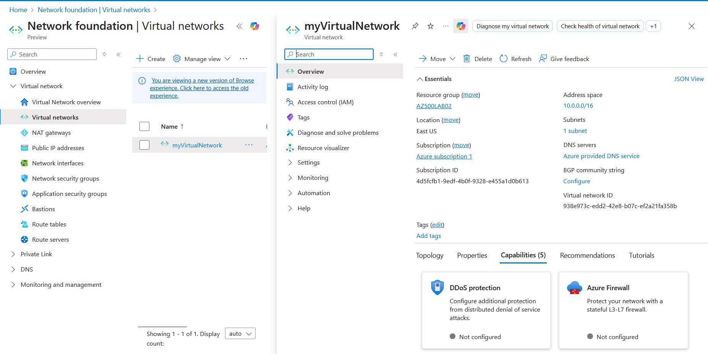
</figure>

2. Create application security groups: *myAsgWebServers* & *myAsgMgmtServers*
<figure>
  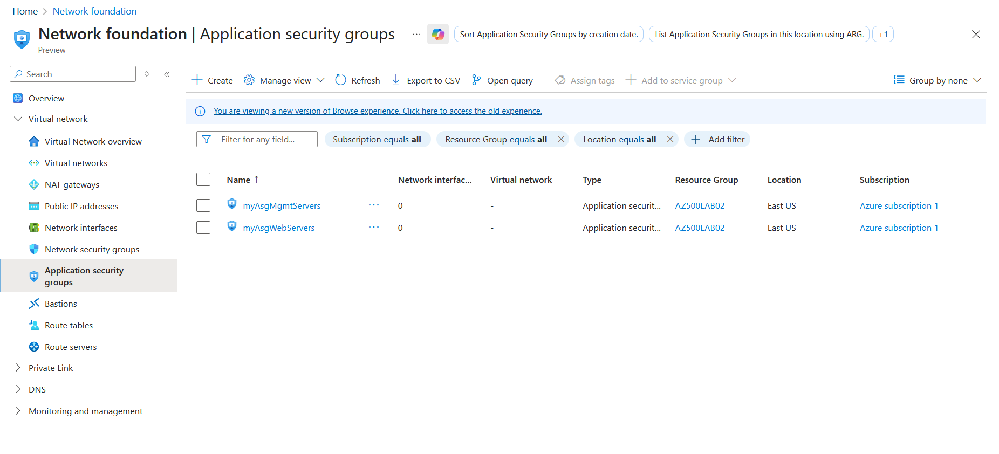
  </figcaption>
</figure>

3. Create a network security group (NSG) *myNSG* and associate the NSG to the subnet
<figure>
  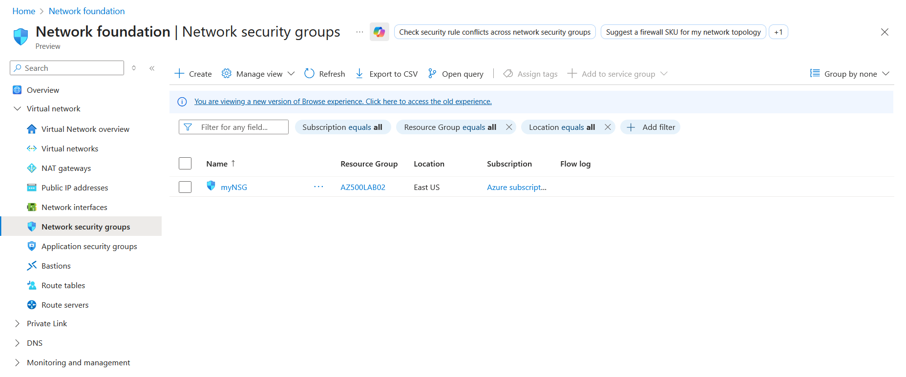
  </figcaption>
</figure>

<figure>
  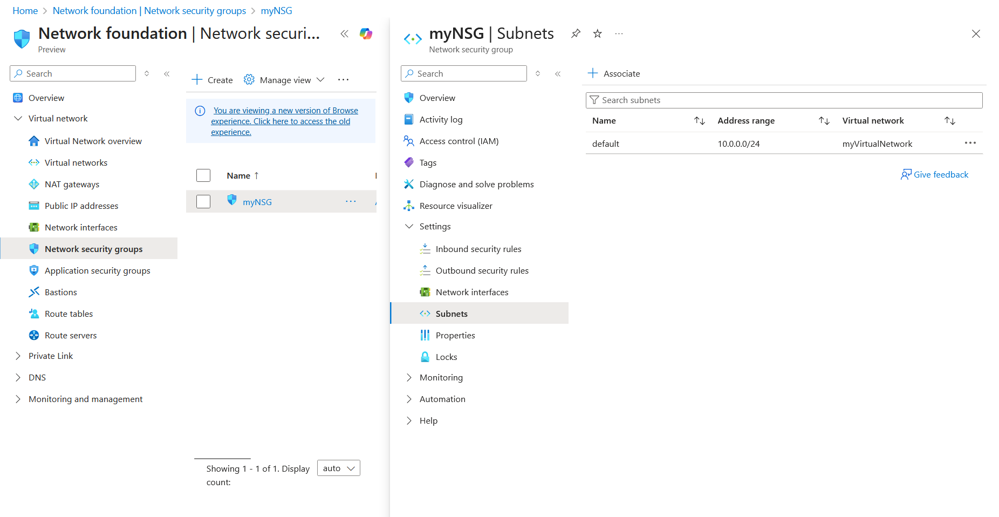
  </figcaption>
</figure>

4. Create inbound NSG security rules to allow HTTP/HTTPS traffic to web servers and RDP to the management servers

<figure>
  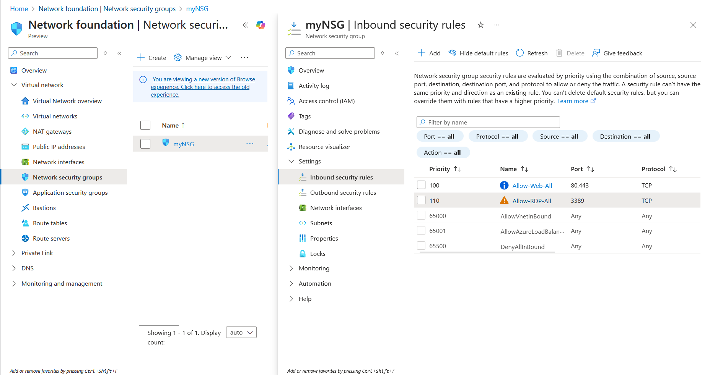
  </figcaption>
</figure>


## Exercise 2: Deploy virtual machines and test network filters
1. Create a virtual machine to use as a web server: *myVmWeb*
<figure>
  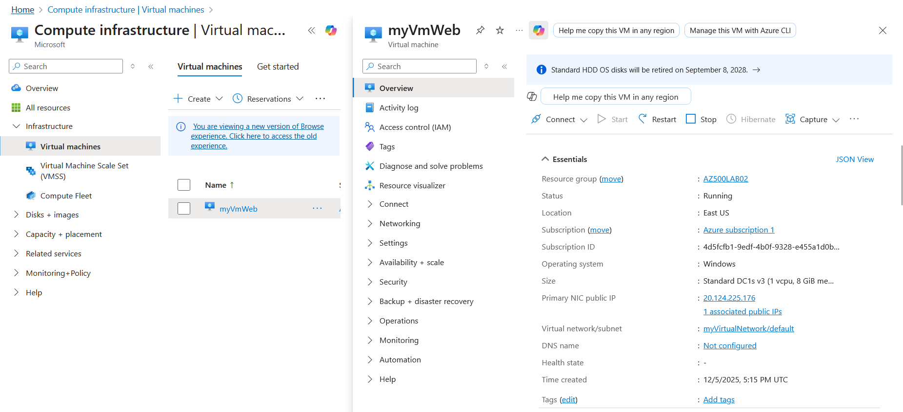
  </figcaption>
</figure>

2. Create a virtual machine to use as a management server: *myVmMgmt*
<figure>
  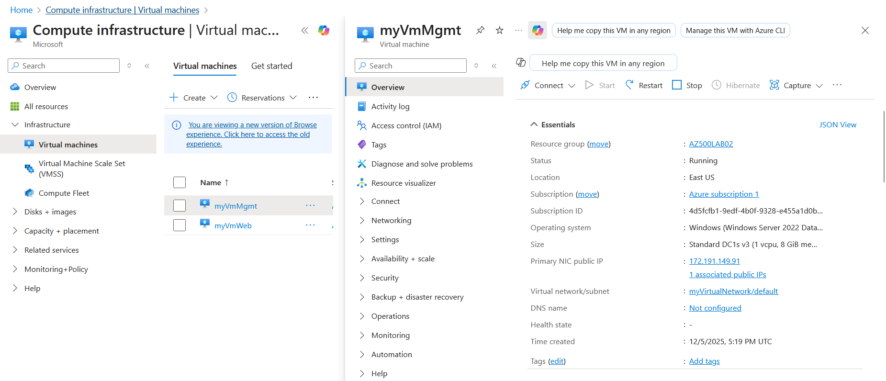
  </figcaption>
</figure>

3. Associate each virtual machine's network interface to its application security group
<figure>
  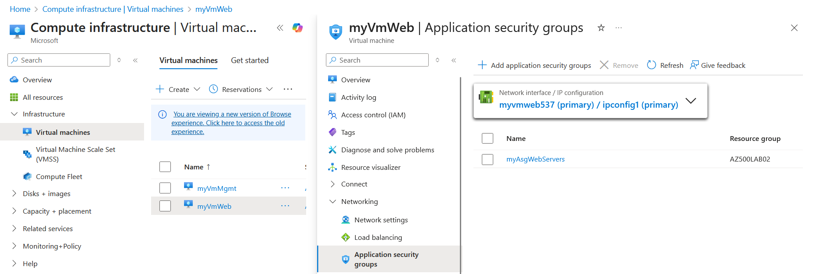
  </figcaption>
</figure>

<figure>
  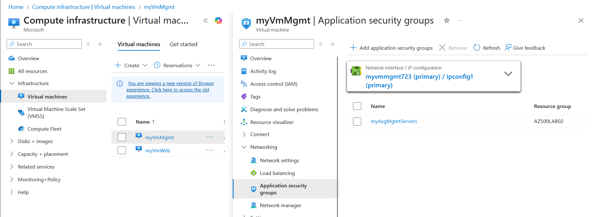
  </figcaption>
</figure>

4. Test the network traffic filtering

Install Windows web server role on *myVmWeb*: ```Install-WindowsFeature -name Web-Server -IncludeManagementTools```

<figure>
  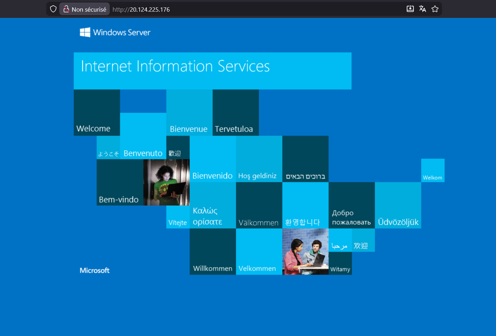
  </figcaption>
</figure>

<figure>
  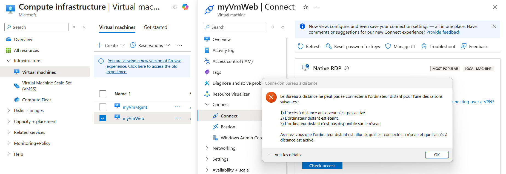
  </figcaption>
</figure>

*myVmWeb* is accessible from browser using HTTP but is not accessible using other protocols (e.g., RDP).

<figure>
  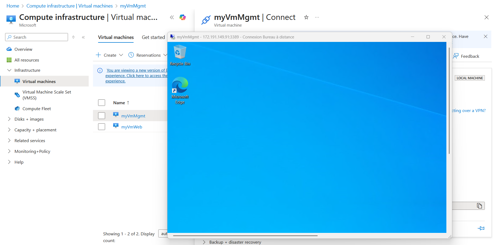
  </figcaption>
</figure>

<figure>
  
  </figcaption>
</figure>

*myVmMgmt* is accessible from browser using RDP but is not accessible using other protocols (e.g., HTTP).

5. Clean-up resources

```Remove-AzResourceGroup -Name "AZ500LAB07" -Force -AsJob```

