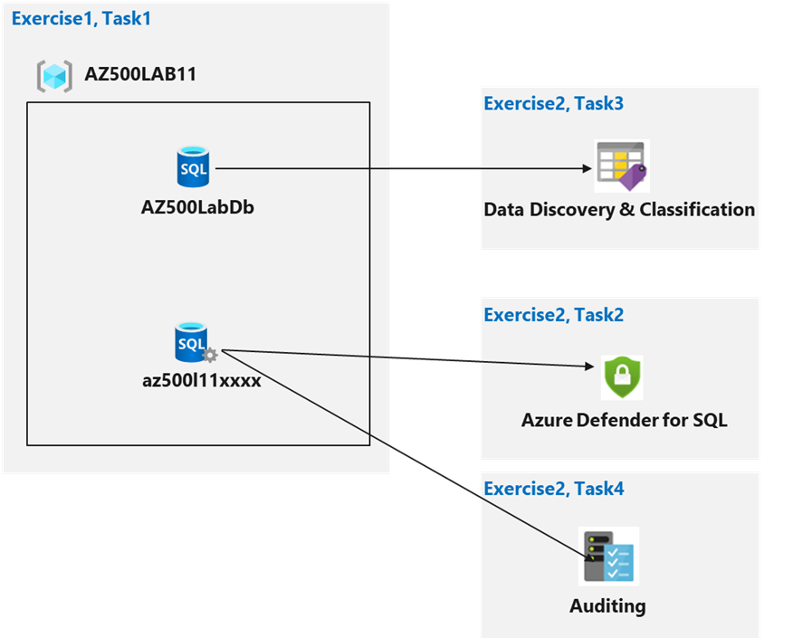
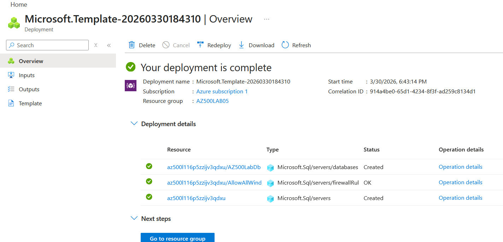
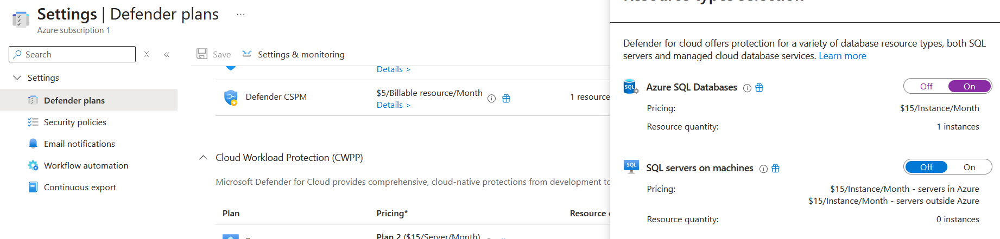
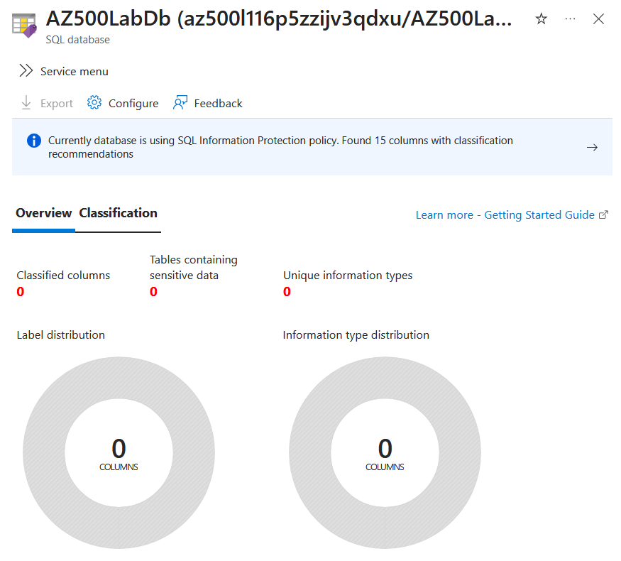
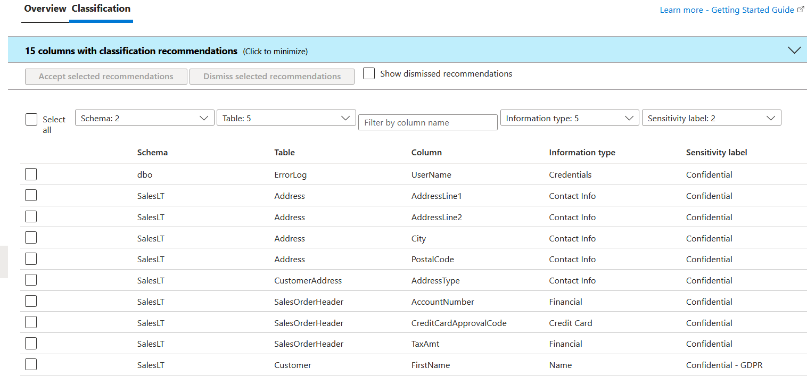
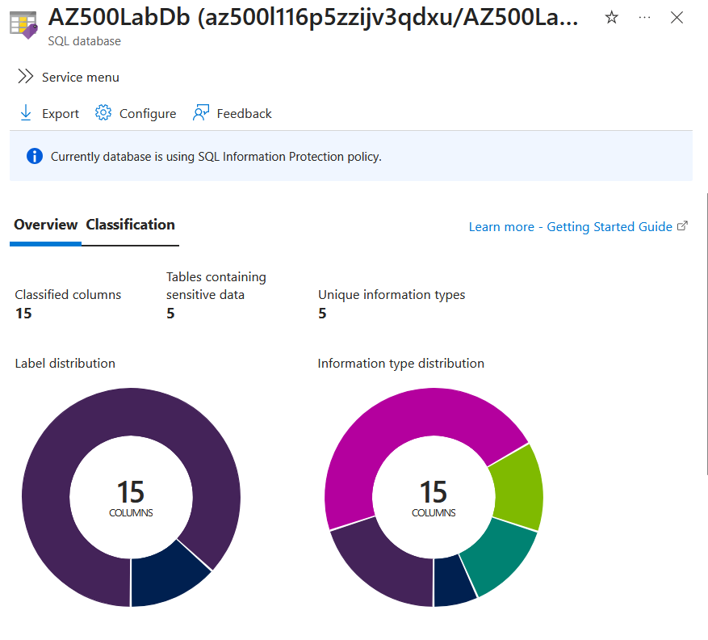
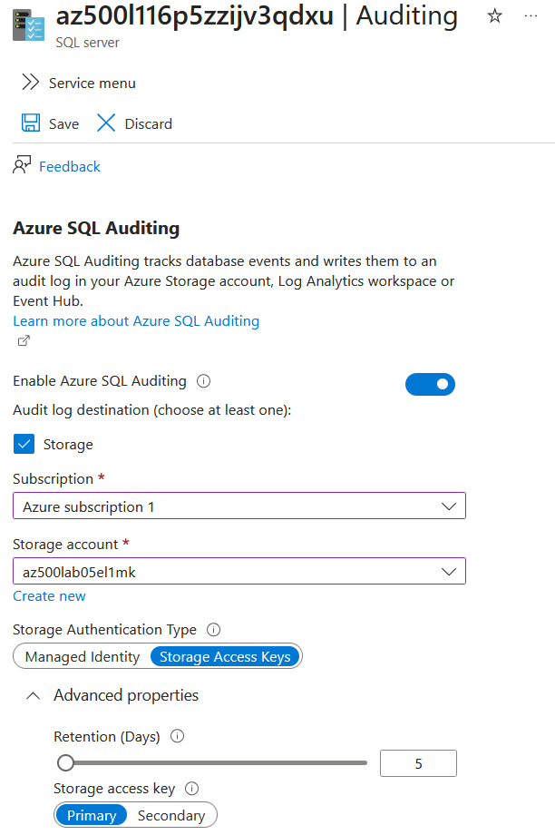
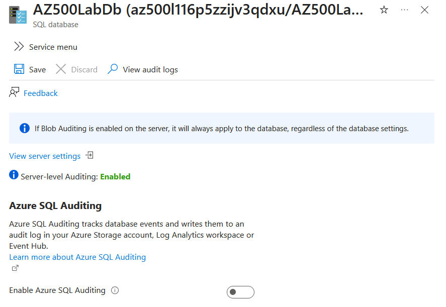
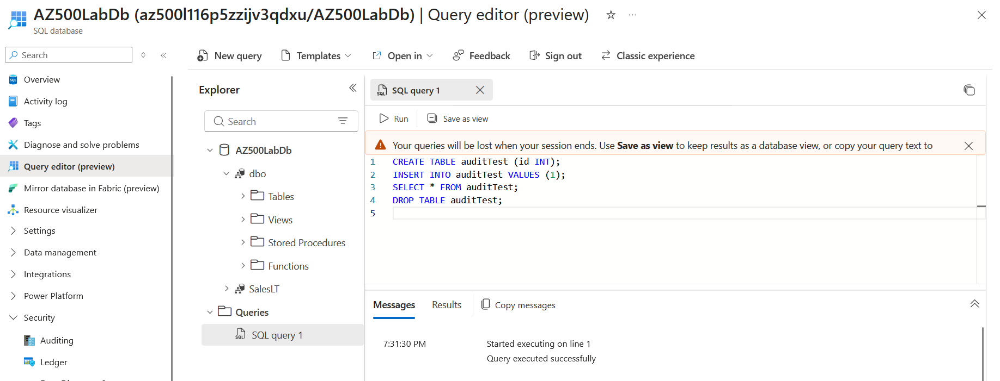
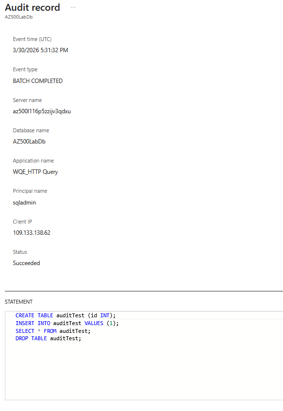

# Exercise 1: Implement SQL Database security features

## Task 1: Deploy an Azure SQL Database
The goal of this first task is to deploy the lab infrastructure below using the file in the folder [/scripts](https://github.com/EL1MK/AZ500-LAB05-SecureAzureSQLDatabase/tree/main/scripts).

<figure>
  
</figure>

After modifying the region in the original lab deployment template from eastus to westeurope for resources availability reasons, the architecture is deployed:

<figure>
  
</figure>

## Task 2: Configure Advanced Data Protection

The goal here is to deploy Microsoft Defender for SQL.

On the Microsoft Defender for Cloud console, Microsoft Defender for SQL is enabled:

<figure>
  
</figure>

Unfortunately, contrary to what is stated in the lab guidance, no recommendations appear in the Microsoft Defender for Cloud dashboard. This is due to the upgrade of the services which does not provide recommendations on newly created resources with default official configuration.

I have tried some simple brute-force attempts on the SQL database using the below command to trigger an alert but Defender for SQL PaaS does not generate such alerts in such conditions.

```sh
sqlcmd -S az500l116p5zzijv3qdxu.database.windows.net -U wronguser -P wrongpassword
```

<figure>
  
</figure>


## Task 3: Configure Data Classification

The goal in this step is to activate Data Classification on our SQL database. After enabling it on the database, 15 columns with classification recommendations are found:

<figure>
  
</figure>

After accepting the selected recommendations the Data Discovery & Classification dashboard displays the applied classification information:

<figure>
  
</figure>


## Task 4 : Configure auditing

The goal of this last task is to first configure server-level auditing and then configure database-level auditing.

First, a storage account is created to store the audit logs and then Azure SQL Auditing is enabled at server-level as such:

<figure>
  
</figure>

<figure>
  
</figure>

Because auditing is enabled at the server-level, it is also enabled at database-level. Audit logs are then centralized at the server auditing scope.

The following query has been performed in the database to generate audit logs:

<figure>
  
</figure>

The query was flagged in the server's audit log as it contains some SQL commands monitored by the audit (e.g., DROP TABLE): 

<figure>
  
</figure>

## Clean-up resources

All resources are deleted using:

 ```powershell
    Remove-AzResourceGroup -Name "AZ500LAB05" -Force -AsJob
 ```
