# Exercise 1: Service endpoints and security storage

The objective of this lab is to secure an Azure File Share by:

* Ensuring traffic to Azure Storage remains within the Azure backbone network.
* Restricting access to resources from a specific subnet.
* Verifying that resources outside the allowed subnet cannot access the storage.
  
The following architecture will be set up:

<figure>
  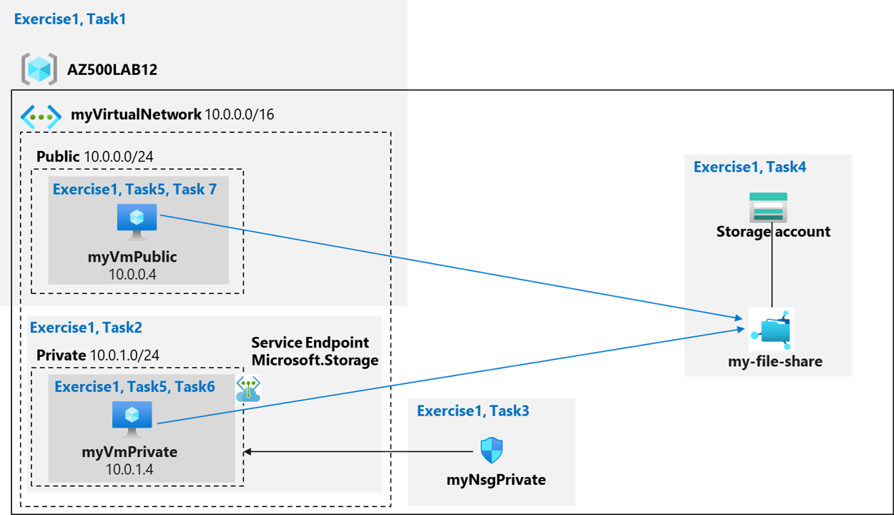
</figure>

## Task 1-2: Create a virtual network and its subnets

The first task is to create a virtual network and the two subnets Public and Private:

<figure>
  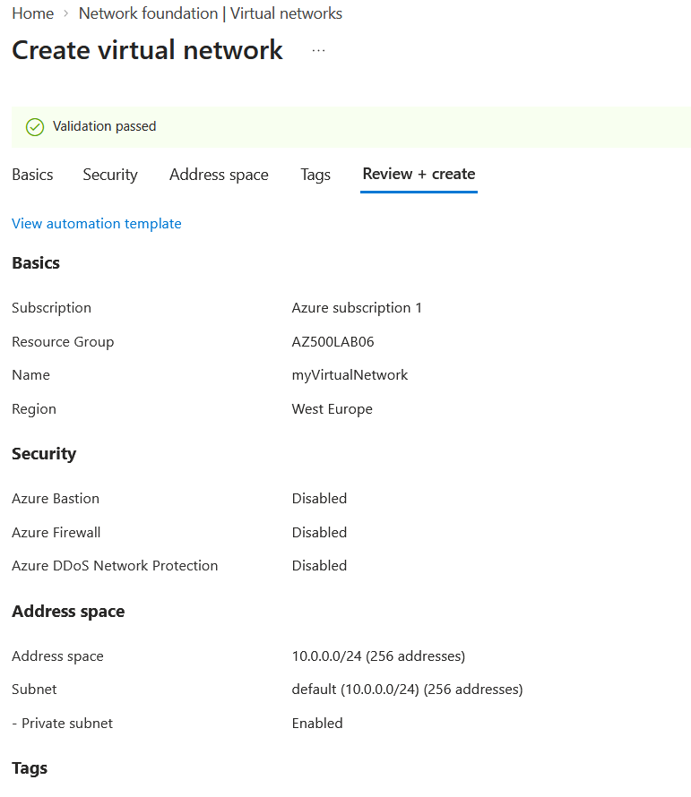
</figure>

<figure>
  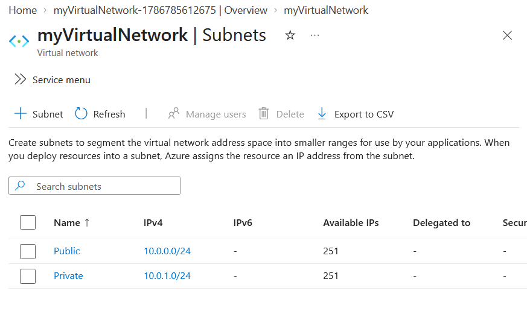
</figure>

<figure>
  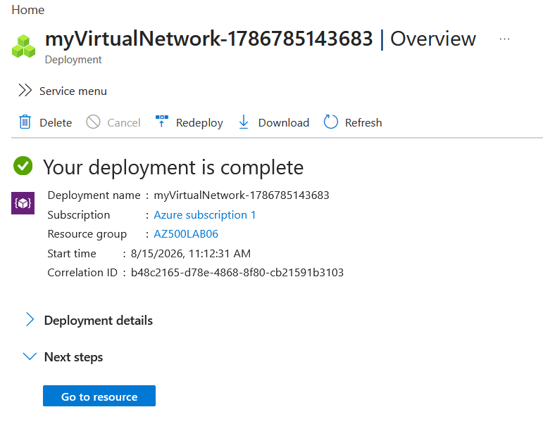
</figure>

## Task 3: Configure a network security group to restrict access to the private subnet

The goal of this step is to create a network security group with two outbound security rules (Storage and internet) and one inbound security rule (RDP). This NSG is associated with the Private subnet. This restricts outbound traffic from Azure VMs connected to that subnet and allow RDP connection:

<figure>
  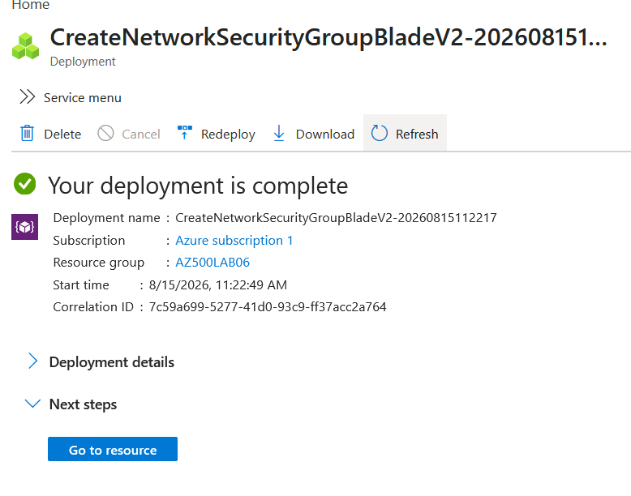
</figure>
<figure>
  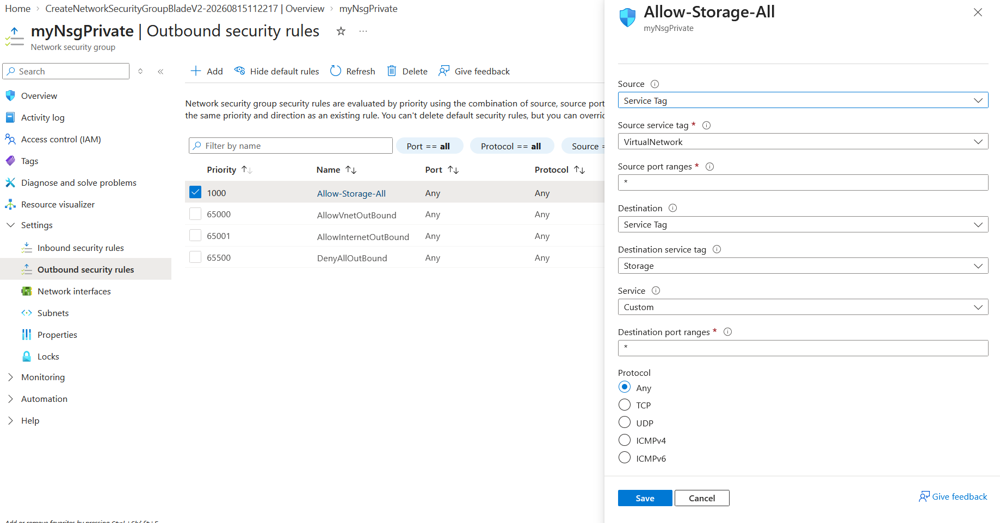
</figure>
<figure>
  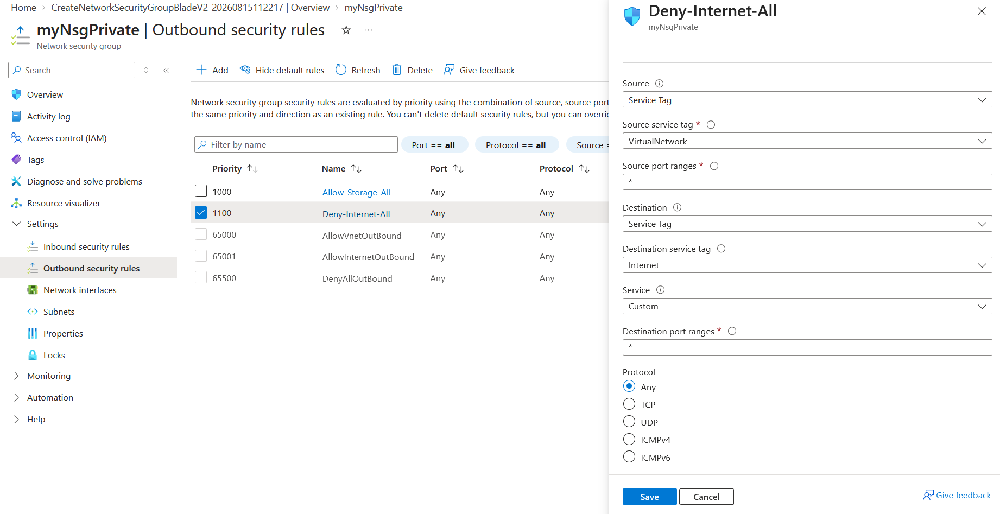
</figure>
<figure>
  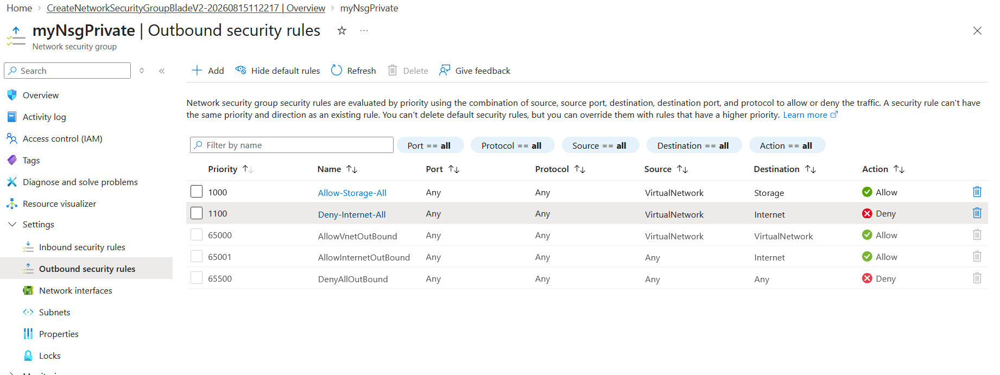
</figure>
<figure>
  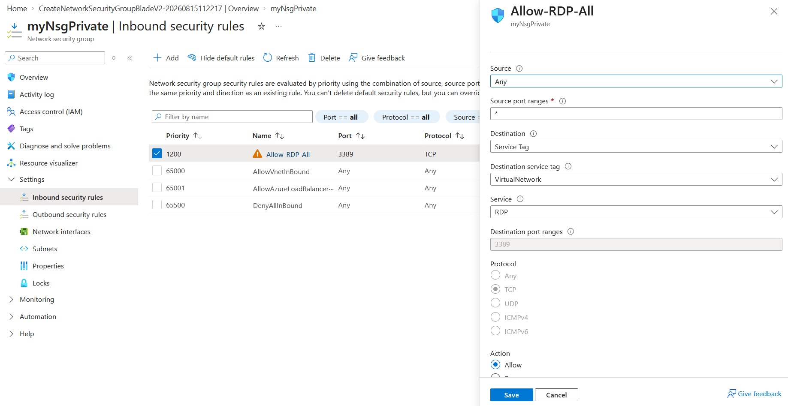
</figure>
<figure>
  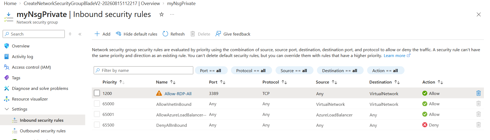
</figure>

## Task 4: Configure a network security group to allow RDP on the public subnet

In this task, a network security group is created with one inbound security rule (RDP). The NSG is associated with the Public subnet. This allows RDP access to the Public VM:
<figure>
  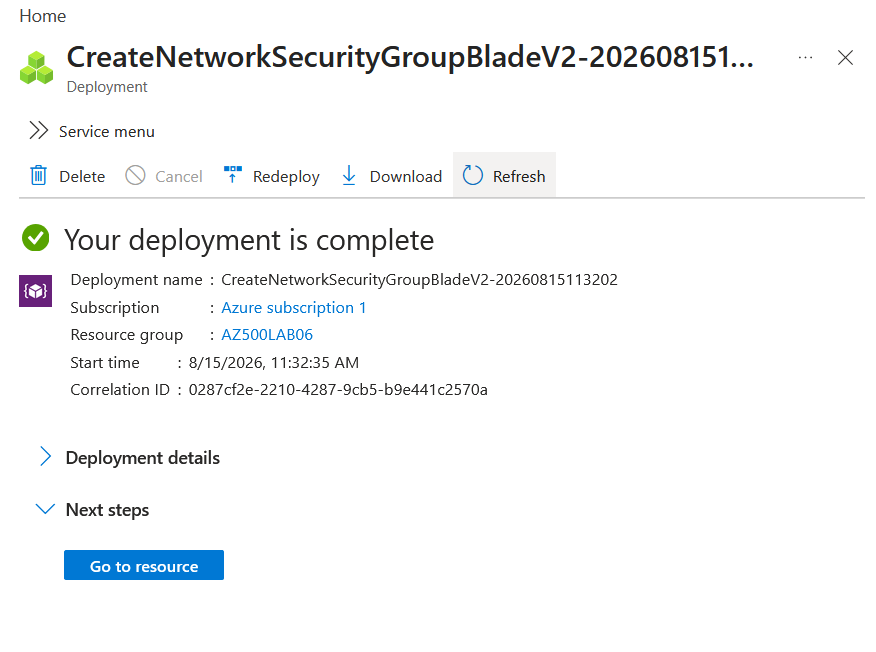
</figure>
<figure>
  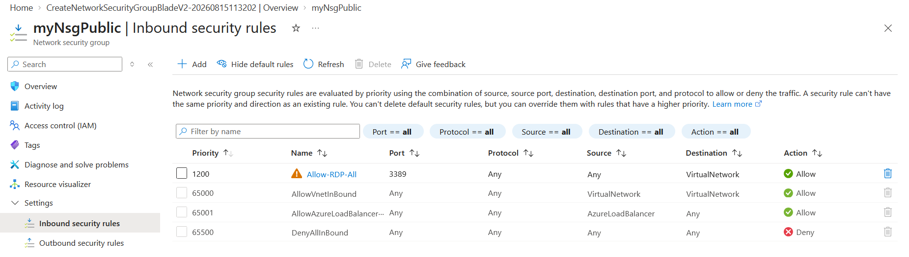
</figure>

## Task 5: Create a storage account with a file share

Now, a storage account is created:
<figure>
  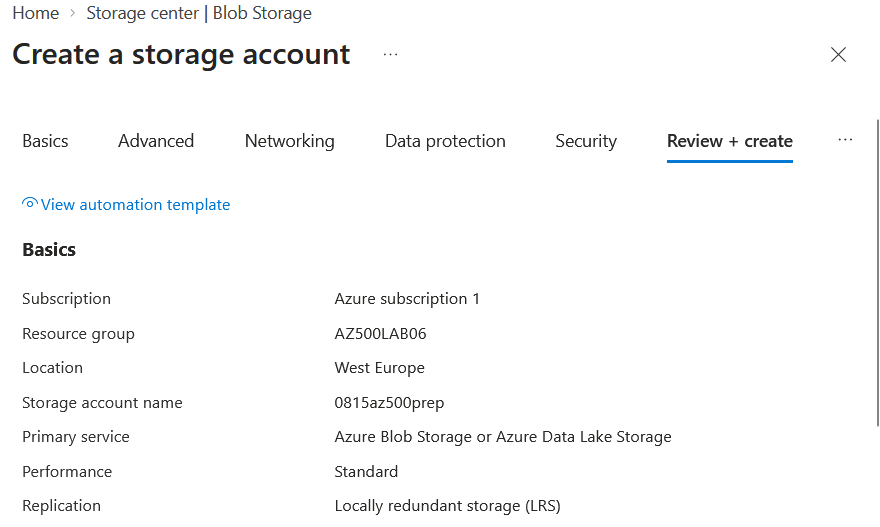
</figure>
<figure>
  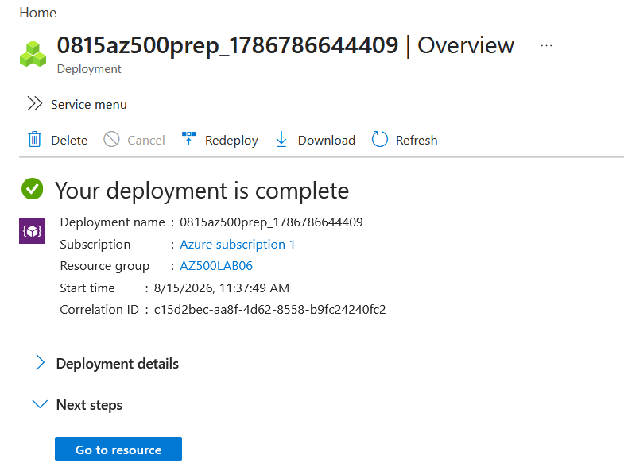
</figure>
<figure>
  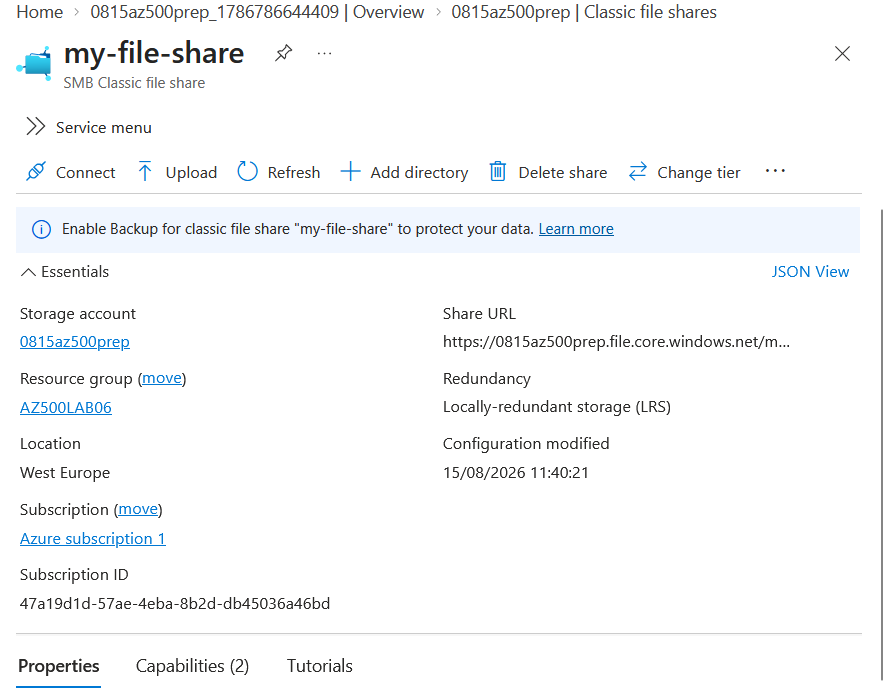
</figure>

 At this stage, the Powershell script used to connect to the file share (i.e., mounting the drive) is recorded for a later step.

 The network access of the file share is then configured to only accept connections from the private endpoint through a service endpoint (this automatically enables the service endpoint in the private subnet). The service endpoint ensures that the connection remains on the Azure backbone.

 <figure>
  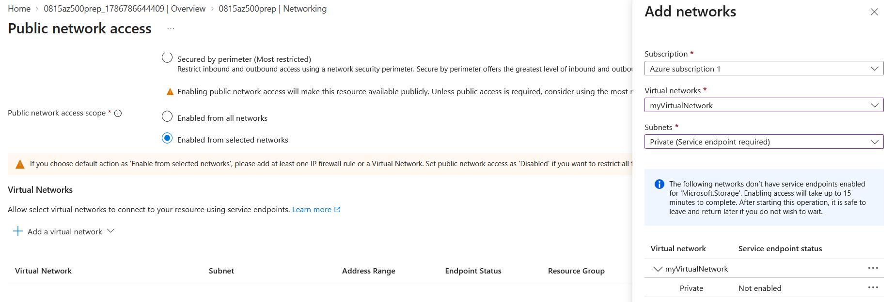
</figure>

## Task 6: Deploy virtual machines into the designated subnets

 One virtual machine per subnet is created with default settings (ports configuration relies on NSGs):
 <figure>
  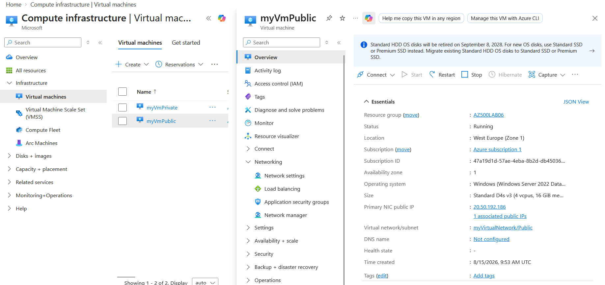
</figure>

## Task 7: Test the storage connection from the private subnet to confirm that access is allowed

To test the storage connection, an RDP connection is made to the VM in the private subnet. The Storage Account key is used here for test purposes but leveraging Entra ID would be the best practice.  The script to connect to the storage account is executed in a Powershell console in the VM and the file share is mounted and accessible (drive Z):
 ```powershell
$connectTestResult = Test-NetConnection -ComputerName <storage_account_name>.file.core.windows.net -Port 445
if ($connectTestResult.TcpTestSucceeded) {
   # Save the password so the drive will persist on reboot
   cmd.exe /C "cmdkey /add:`"<storage_account_name>.file.core.windows.net`" /user:`"localhost\<storage_account_name>`"  /pass:`"<storage_account_key>`""
   # Mount the drive
   New-PSDrive -Name Z -PSProvider FileSystem -Root "\\<storage_account_name>.file.core.windows.net\my-file-share" -Persist
} else {
   Write-Error -Message "Unable to reach the Azure storage account via port 445. Check to make sure your organization or ISP is not blocking port 445, or use Azure P2S VPN, Azure S2S VPN, or Express Route to tunnel SMB traffic over a different port."
}
```
 
 <figure>
  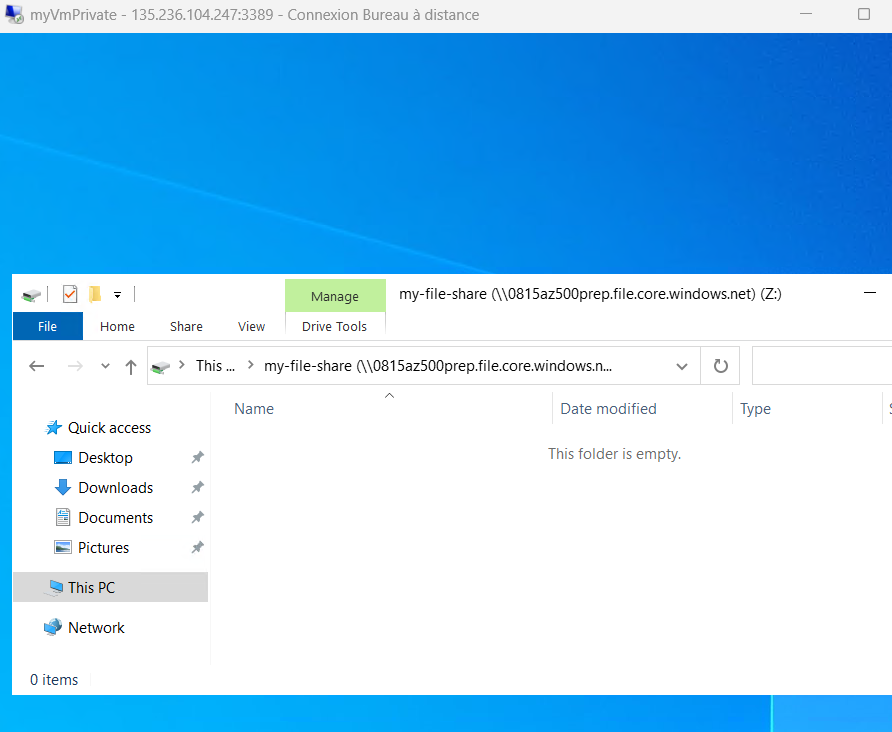
</figure>

However, as defined in the NSG, the internet is not reachable from this VM:
 <figure>
  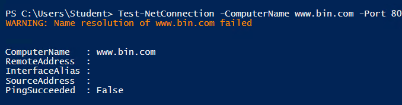
</figure>

## Task 8: Test the storage connection from the public subnet to confirm that access is denied

To test the connection from the public subnet, a connection is made to the VM in the public subnet. By executing the same Powershell script, the access is denied as the NSGs and network rules of the storage account don't allow such access:
 <figure>
  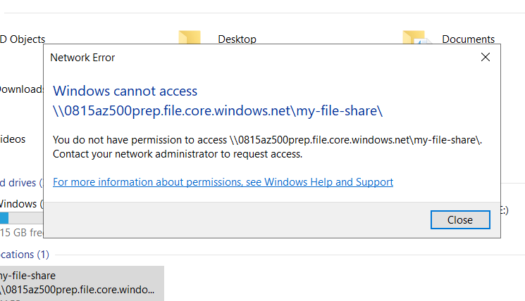
</figure>

However, the access to the internet is allowed, as expected:
 <figure>
  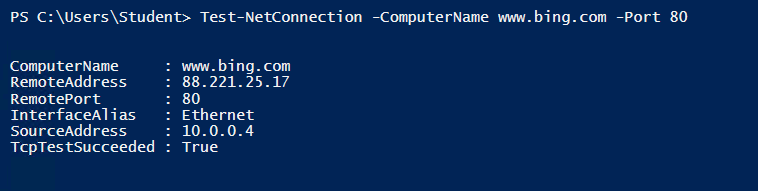
</figure>
