# Introduction

The objective of this lab is to build a proof-of-concept application using Azure SQL Database Always Encrypted to protect sensitive data.

The lab includes:

* Creating an Azure Key Vault to securely store encryption keys and secrets.
* Creating an Azure SQL Database and using Always Encrypted to encrypt sensitive columns.
* Registering the application in Microsoft Entra ID to enhance authentication and security.
* Using a preconfigured Virtual Machine with Visual Studio and SQL Server Management Studio to focus on the security configuration.

The following architecture will be set up (discard the exercise references):

<figure>
  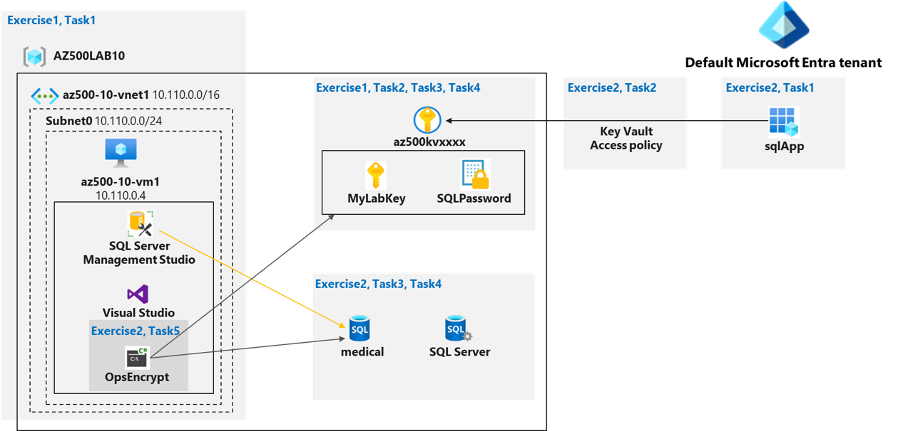
</figure>

For availability reasons, the region used in this lab will not be East US but West Europe.

# Exercise 1: Deploy the base infrastructure from an ARM template

## Task 1: Deploy an Azure VM and Azure SQL database

First, an Azure VM and its environment are deployed. The ARM template used is available [here](scripts/az-500-10_baseinfra.json). The deployment is described as follows:

<figure>
  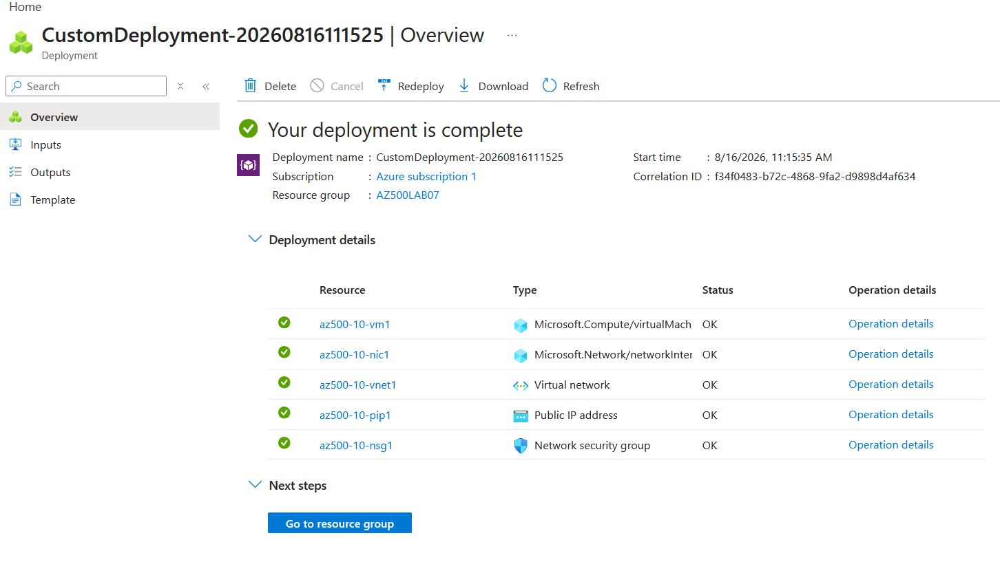
</figure>

Another template available [here](scripts/az-500-10-DB.json) is used to deploy an Azure SQL server and database named *medical*.

<figure>
  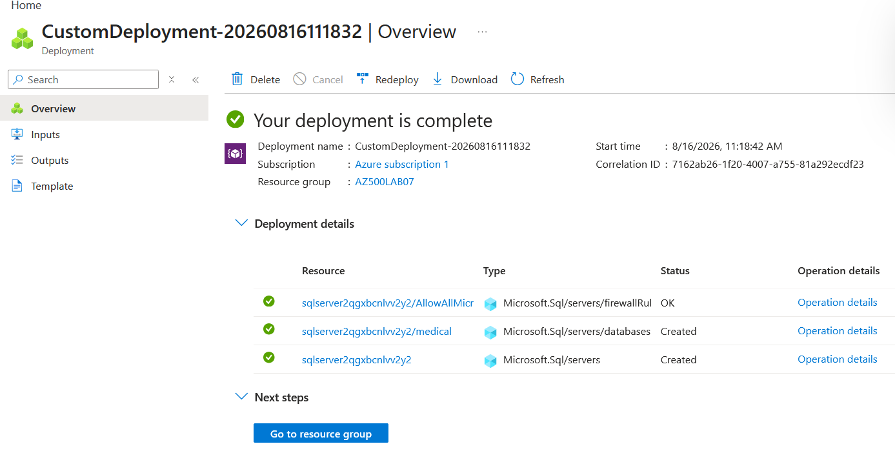
</figure>

# Exercise 2: Configure the Key Vault resource with a key and a secret

## Task 1: Create and configure a Key Vault

To create an Azure Key Vault, the following PowerShell command is executed in the Shell pane:

```powershell
$kvName = 'az500kv' + $(Get-Random)

$location = (Get-AzResourceGroup -ResourceGroupName 'AZ500LAB07').Location

New-AzKeyVault -VaultName $kvName -ResourceGroupName 'AZ500LAB07' -Location $location -DisableRbacAuthorization
```
The following is obtained after executing the last command, confirming the vault's deployment:

<figure>
  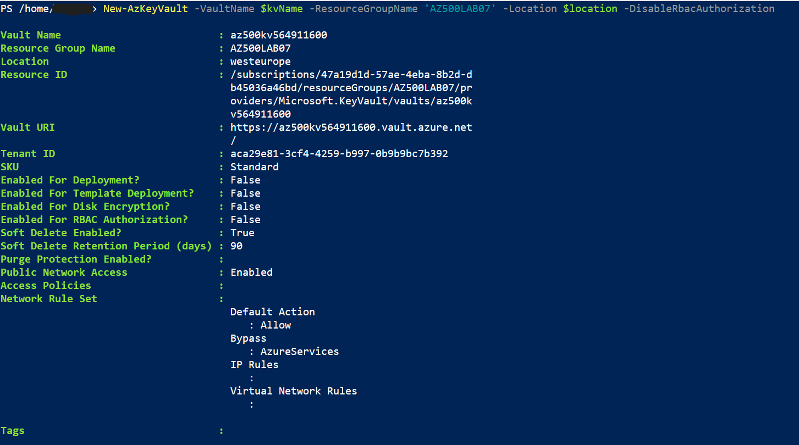
</figure>

Then, an access policy is created with extended permissions on the keys, secrets and certificates as displayed for the user performing this lab:

<figure>
  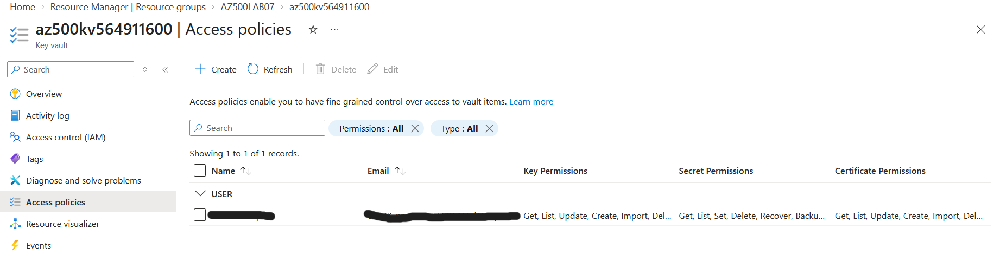
</figure>

## Task 2: Add a key to Key Vault

In this step, a key "MyLabKey" is generated and stored in the vault using the following PowerShell commands:

```powershell
$kv = Get-AzKeyVault -ResourceGroupName 'AZ500LAB07'

$key = Add-AZKeyVaultKey -VaultName $kv.VaultName -Name 'MyLabKey' -Destination 'Software'
```

To verify the key was created the following PowerShell command is executed and gives the following result:

```powershell
Get-AZKeyVaultKey -VaultName $kv.VaultName
```
<figure>
  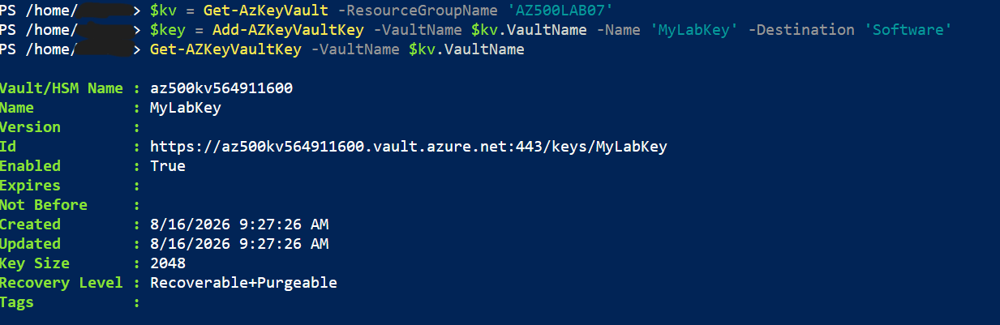
</figure>

A more detailed overview of the key properties can be seen on the Azure portal:

<figure>
  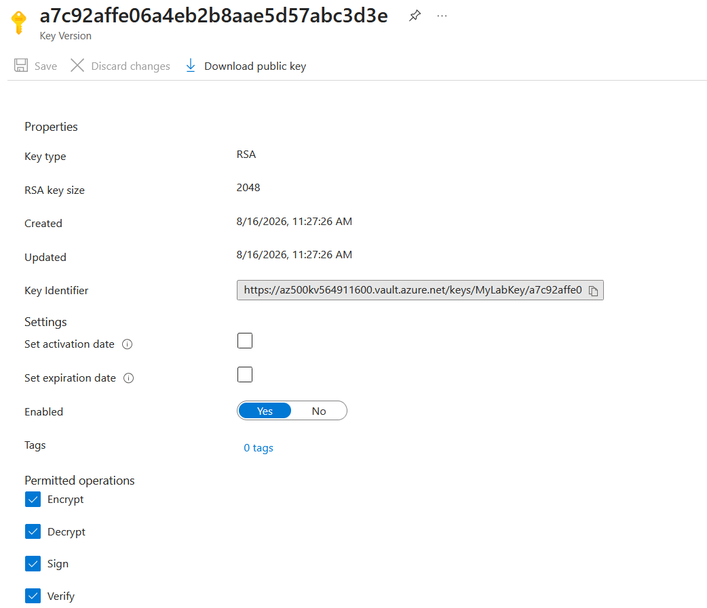
</figure>

## Task 3: Add a Secret to Key Vault

In this step, a secret "SQLPassword" is created and stored in the vault using the following PowerShell commands:

```powershell
$secretvalue = ConvertTo-SecureString 'Pa55w.rd1234' -AsPlainText -Force
$secret = Set-AZKeyVaultSecret -VaultName $kv.VaultName -Name 'SQLPassword' -SecretValue $secretvalue
```
To verify the secret was created, the following PowerShell command is executed and gives the following result:

<figure>
  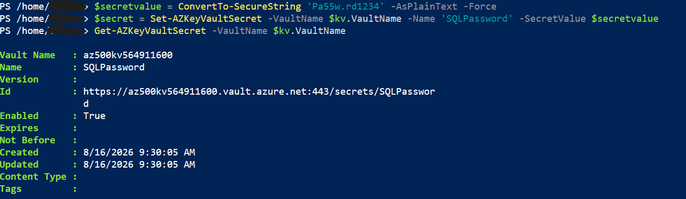
</figure>

A more detailed overview of the secret properties can be seen on the Azure portal:

<figure>
  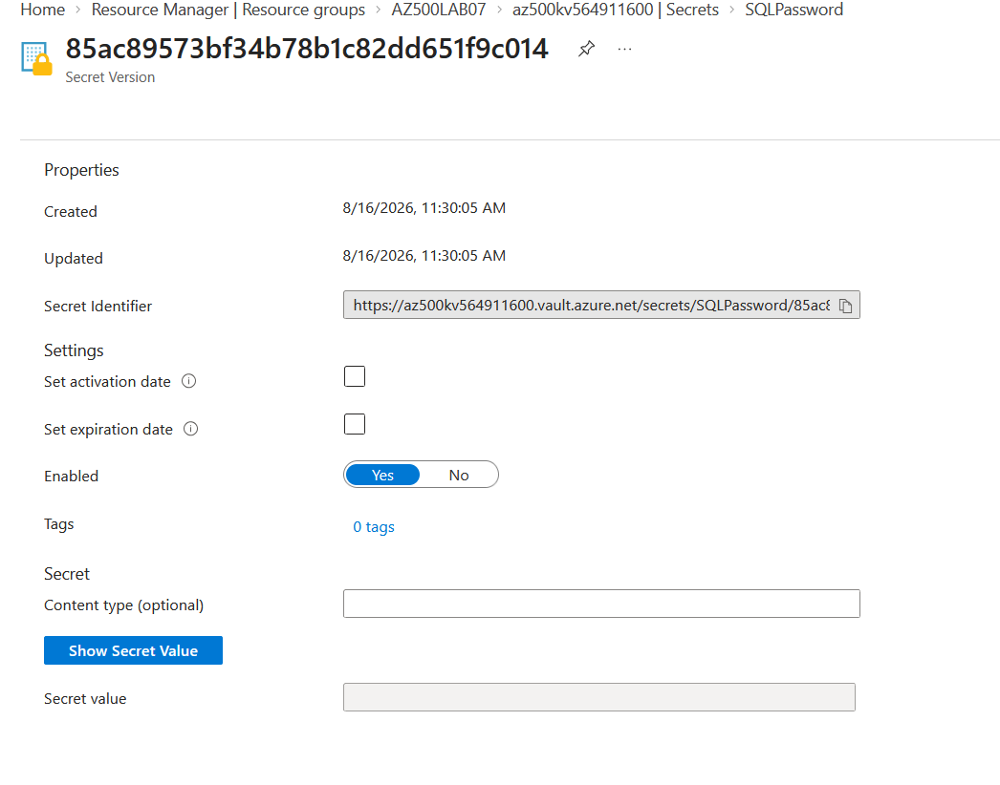
</figure>

# Exercise 3: Configure an Azure SQL database and a data-driven application

## Task 1: Enable a client application to access the Azure SQL Database service.

In this task, a client application will be enabled to access the Azure SQL Database service. The first step is to create an App Registration "sqlApp":

<figure>
  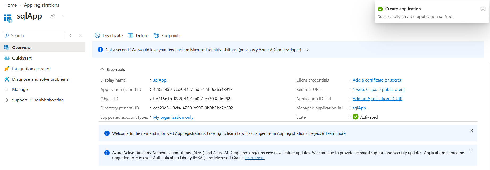
</figure>

A client secret tied to the application is generated as such:

<figure>
  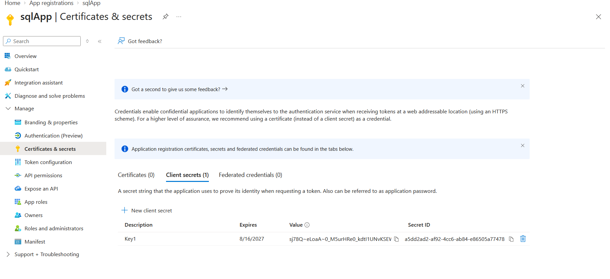
</figure>

## Task 2: Create a policy allowing the application access to the Key Vault.

The goal is now to grant the application permissions to access the keys stored in the Key Vault. The following PowerShell commands are executed to create an access policy:

```powershell
$applicationId = '42852450-7cc9-44a7-ade2-5bf926a48913'
$kvName = (Get-AzKeyVault -ResourceGroupName 'AZ500LAB07').VaultName
Set-AZKeyVaultAccessPolicy -VaultName $kvName -ResourceGroupName AZ500LAB07 -ServicePrincipalName $applicationId -PermissionsToKeys get,wrapKey,unwrapKey,sign,verify,list
```
*Note : vault access policies are not considered a best security practice and Azure RBAC should be preferred.*

## Task 3: Retrieve SQL Azure database ADO.NET Connection String

To connect later to the SQL database, the ADO.NET connection string will be retrieved from the Azure Portal for later use:

<figure>
  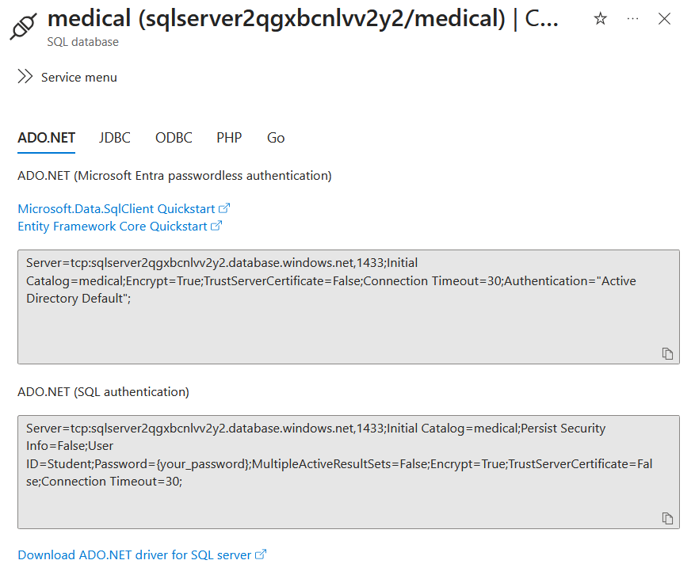
</figure>

## Task 4: Log on to the Azure VM running SQL Server Management Studio

In this task, a connection is made to the Azure VM deployed in the first exercise using an RDP connection.

## Task 5: Create a table in the SQL Database and select data columns for encryption

The goal of this step is to connect to the SQL Database from the VM using SQL Server Management Studio and create a table. Then, two data columns will be encrypted using an autogenerated key in Azure Key Vault using Always Encrypted.

First, the SQL Server firewall rules are defined to allow access from the VM:

<figure>
  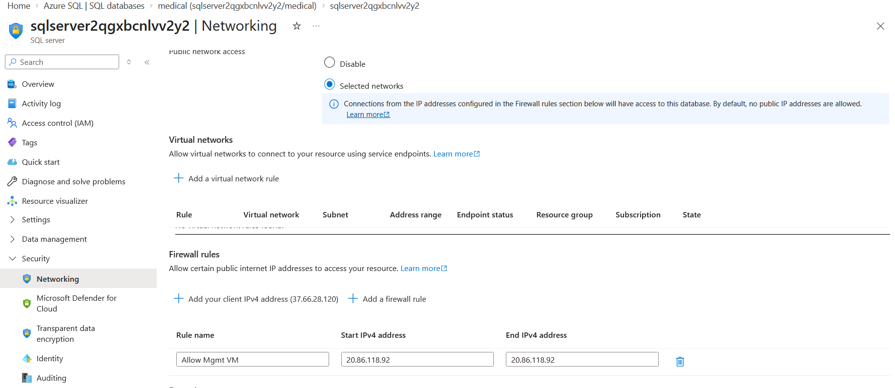
</figure>

After installing SQL Server Management Studio (SSMS) on the VM, a connection is made using the user Student defined in the ARM template and the admin password:

<figure>
  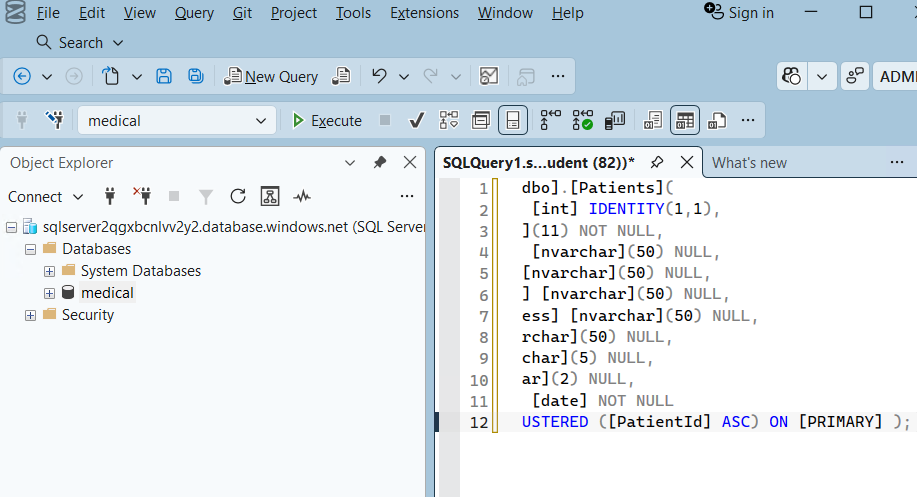
</figure>

The following code is executed in the SSMS query window to create a Patients table in the database:

```sql
     CREATE TABLE [dbo].[Patients](
		[PatientId] [int] IDENTITY(1,1),
		[SSN] [char](11) NOT NULL,
		[FirstName] [nvarchar](50) NULL,
		[LastName] [nvarchar](50) NULL,
		[MiddleName] [nvarchar](50) NULL,
		[StreetAddress] [nvarchar](50) NULL,
		[City] [nvarchar](50) NULL,
		[ZipCode] [char](5) NULL,
		[State] [char](2) NULL,
		[BirthDate] [date] NOT NULL 
     PRIMARY KEY CLUSTERED ([PatientId] ASC) ON [PRIMARY] );
```

Then, in the Object Explorer pane, the Always Encrypted wizard will be launched on the Patients table:

<figure>
  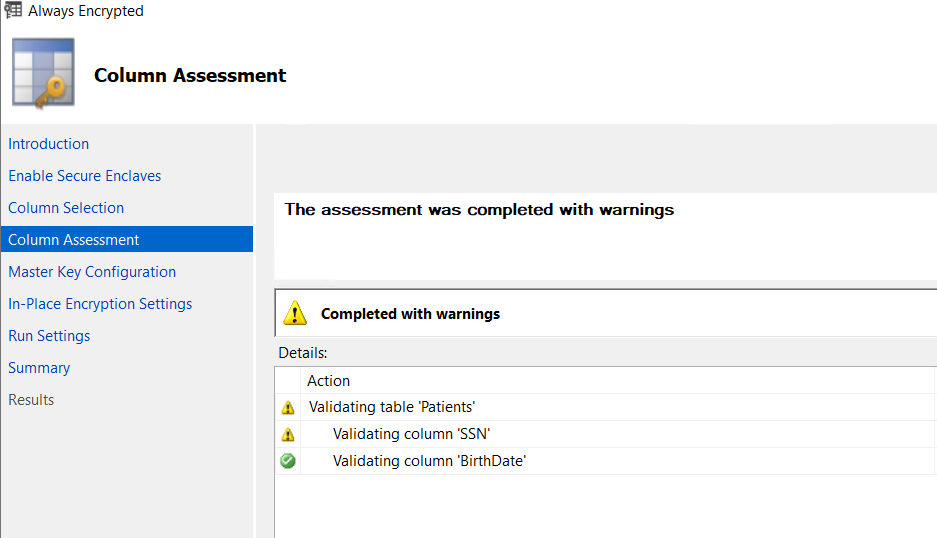
</figure>

After selecting the columns SSN and Birthdate to which encryption should be applied, an encryption key will be automatically generated in the Azure Key Vault (the key generated in the Exercise 2 could have been used): 

<figure>
  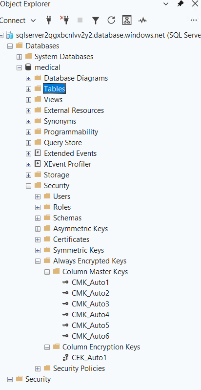
</figure>

By exploring the Always Encrypted subnode in the Object Explorer, the Column Master Key (CMK) and the Column Encryption Key (CEK) can be seen. Multiple CMKs are displayed because multiple encryption attempts were made. Only the metadata of the CMK is stored at the SQL Database level as the CMK itself is stored in the Key Vault. The CMK is used to unwrap/protect the CEK, stored encrypted at the database level, to perform the decryption of the data on the client side:

<figure>
  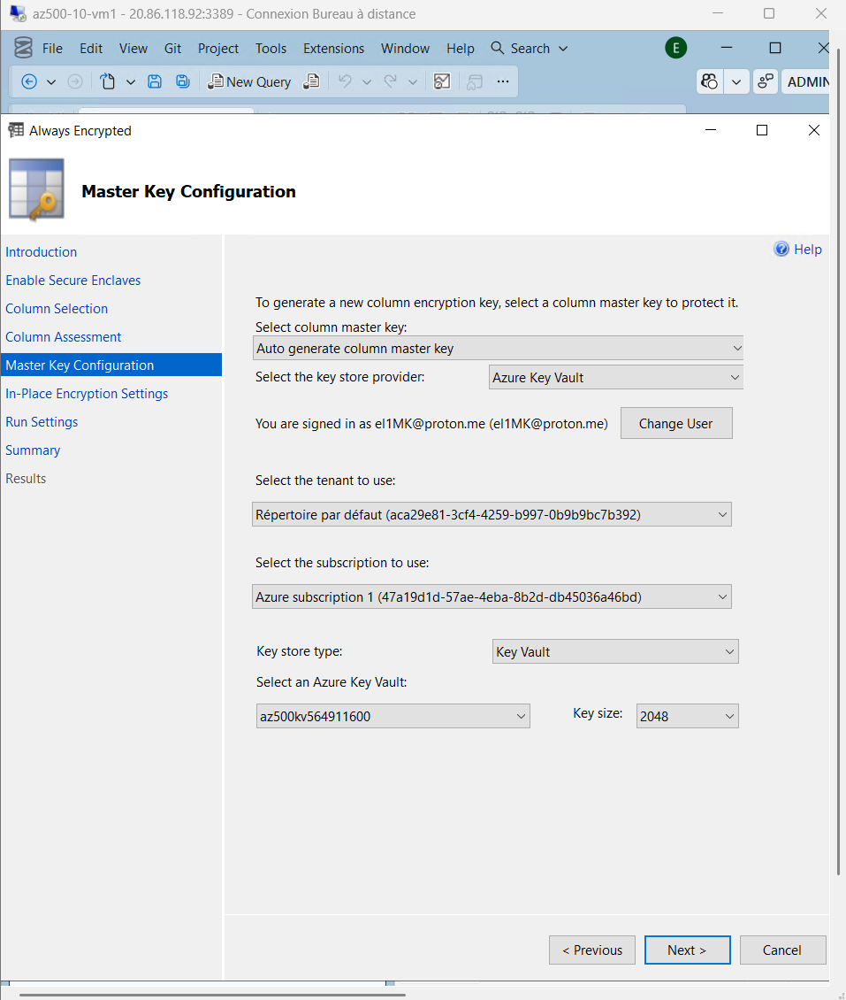
</figure>

# Exercise 4: Demonstrate the use of Azure Key Vault in encrypting the Azure SQL database

## Task 1: Install Visual Studio 2026

Visual Studio 2026 is installed on the Azure VM.

## Task 2: Run a data-driven application to demonstrate the use of Azure Key Vault in encrypting the Azure SQL database

The remaining task of this lab could not be implemented. However, the C# file available [here](scripts/program.cs) gives the application code to be used. The file needs to be modified by adding the ADO.NET connection string with the admin password (this must not be done on production system but is the case here for educational purposes). The Application ID and the client secret value of the application are added (this is not a good security practice and should be avoided in production), allowing the application to authenticate with Microsoft Entra ID to obtain a token for accessing the Key Vault.

To test the workflow, the encryption is first tested at the SSMS level executing:

```sql
SELECT FirstName, LastName, SSN, BirthDate FROM Patients;
```
The result of the query should display encrypted results for SSN and BirthDate fields.

However, if the application is used to query the database, the application will gather the CMK metadata, authenticate with Microsoft Entra ID to access the Key Vault, retrieving the key using the metadata and decrypting the data at the client level. The main feature of Always Encrypted has been demonstrated through this last exercise, leveraging Azure Key Vault in encrypting Azure SQL Database columns.
