# Introduction

In this lab, the objectives are the following:
* Configure the Azure Monitor Agent (AMA) on Azure VMs.
* Create and configure Data Collection Rules (DCRs).
* Collect security events, system logs, and performance counters from Azure VMs.
* Centralize monitoring data for improved security visibility and performance monitoring.

# Exercise 1: Deploy an Azure virtual machine

First, a resource group for the lab is created using the following PowerShell command:

```powershell
  New-AzResourceGroup -Name AZ500LAB08 -Location 'WestEurope'
```

<figure>
  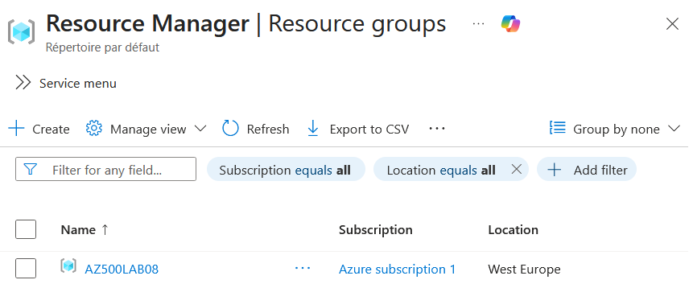
</figure>

Then, the Encryption at Host is registered on the Microsoft.Compute provider for the subscription:

```powershell
  Register-AzProviderFeature -FeatureName "EncryptionAtHost" -ProviderNamespace Microsoft.Compute
```
The following PowerShell is then executed to create the VM:

```powershell
  New-AzVm -ResourceGroupName "AZ500LAB08" -Name "myVM" -Location 'WestEurope' -VirtualNetworkName "myVnet" -SubnetName "mySubnet" -SecurityGroupName   "myNetworkSecurityGroup" -PublicIpAddressName "myPublicIpAddress" -PublicIpSku Standard -OpenPorts 80,3389 -Size Standard_D2_v4
```
To confirm the creation of the new VM, the following PowerShell command is executed:

```powershell
  Get-AzVM -Name 'myVM' -ResourceGroupName 'AZ500LAB08' | Format-Table
```

<figure>
  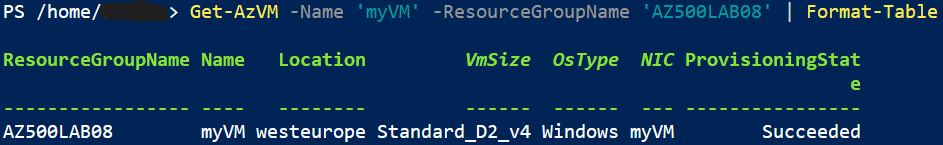
</figure>

# Exercise 2: Create a Log Analytics workspace

A Log Analytics workspace is then created from the Azure portal:

<figure>
  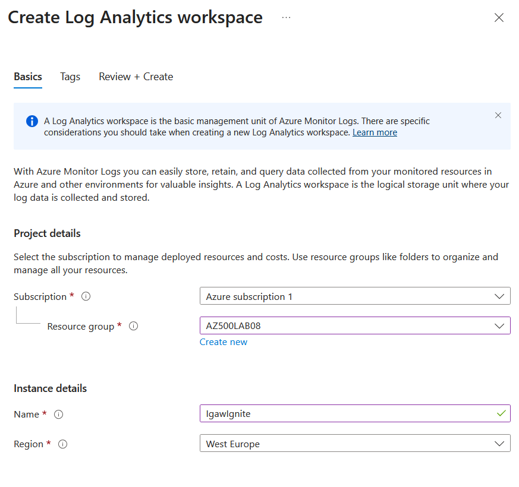
</figure>

<figure>
  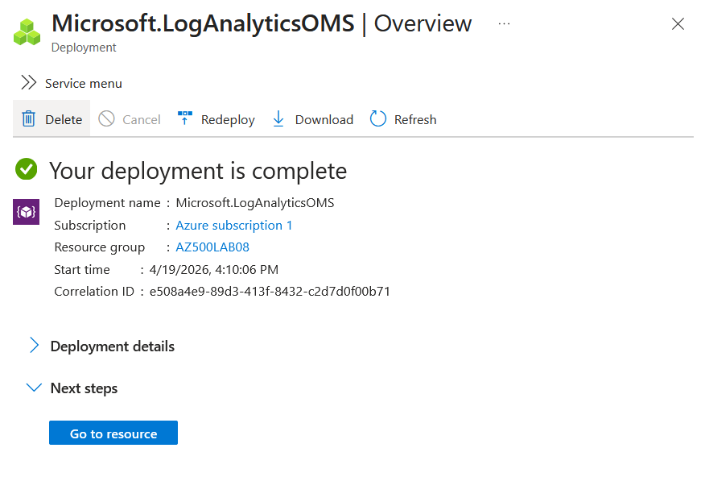
</figure>

# Exercise 3: Create an Azure storage account

Next, an Azure storage account is created from the Azure portal:

<figure>
  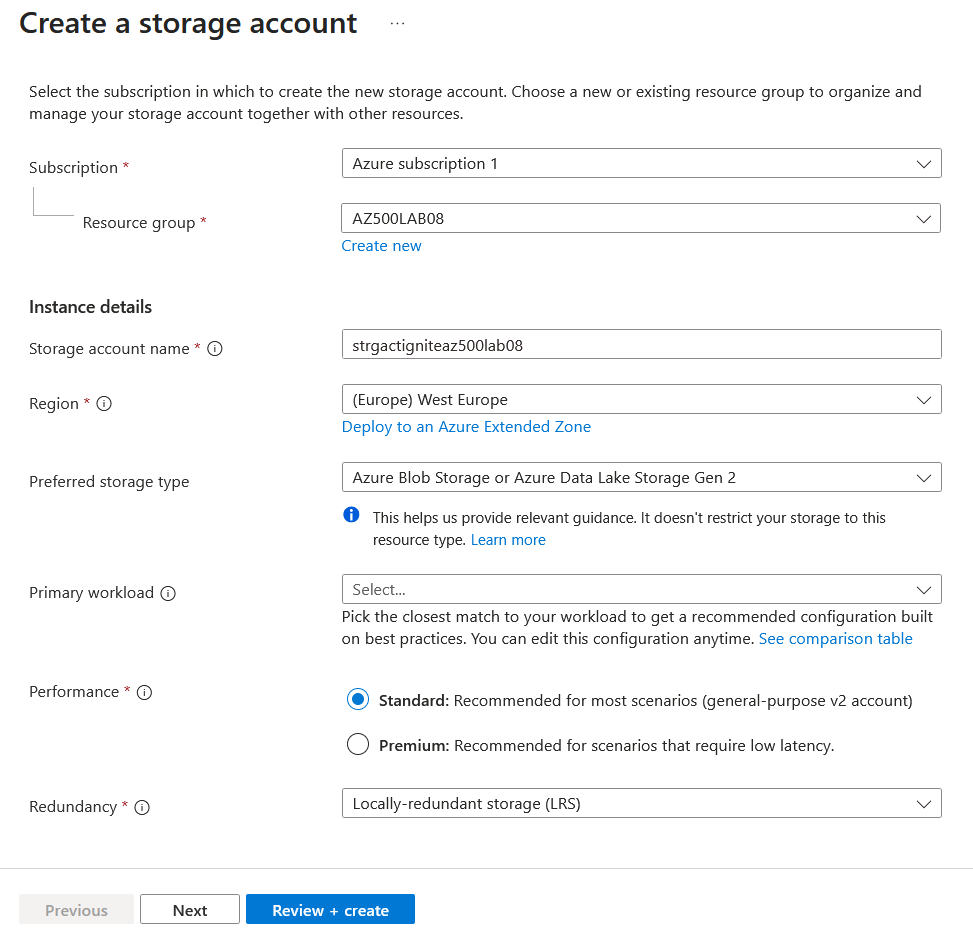
</figure>

<figure>
  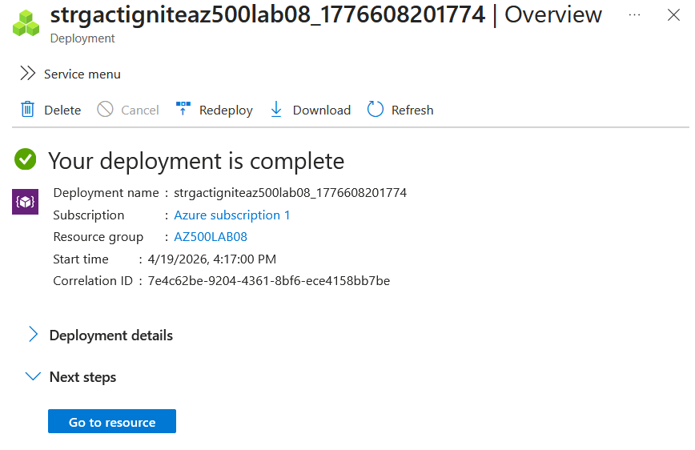
</figure>

*Note: this Storage Account will not be used in this lab as it is intended to be used in the next labs*

# Exercise 4: Create a Data Collection Rule

Finally, a Data Collection Rule (DCR) is created from the Azure portal to collect data using AMA, associated with the VM, configured to collect CPU, memory, disk, and network performance data, and finally configured to send the data to the Log Analytics workspace:

<figure>
  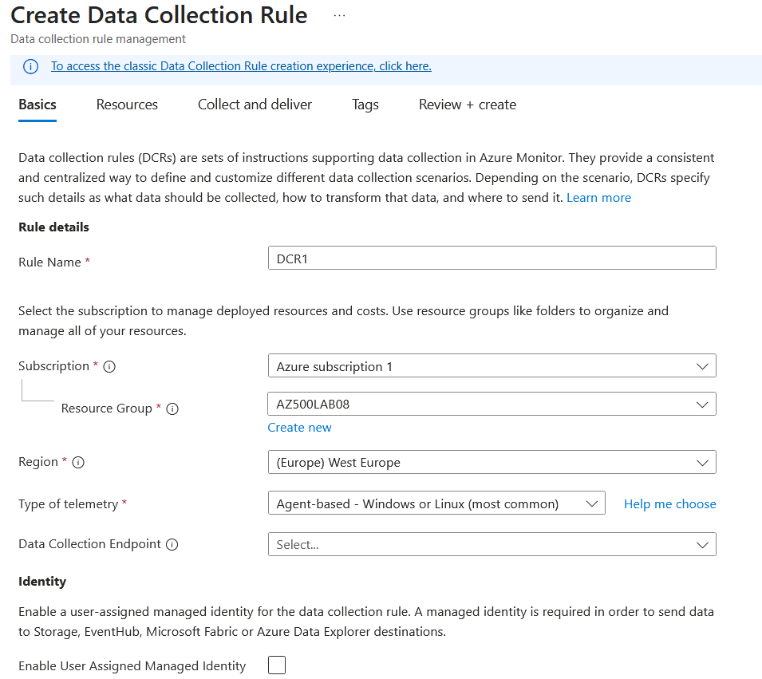
</figure>

<figure>
  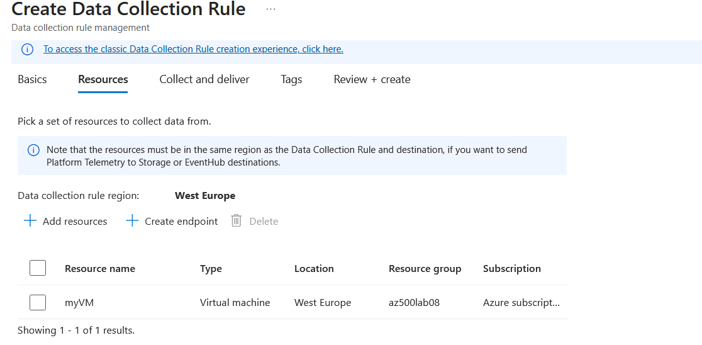
</figure>

<figure>
  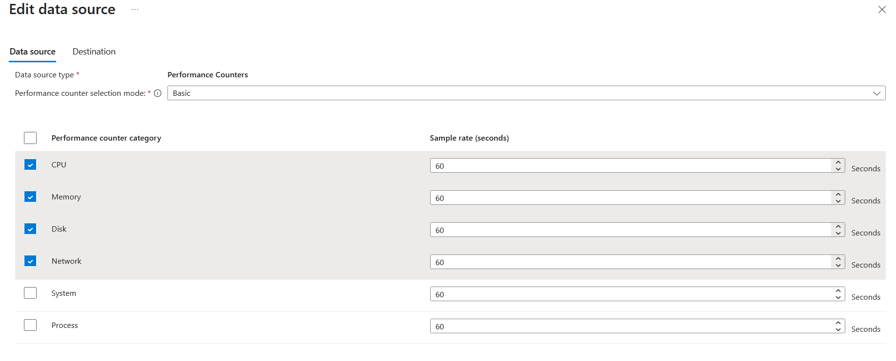
</figure>

<figure>
  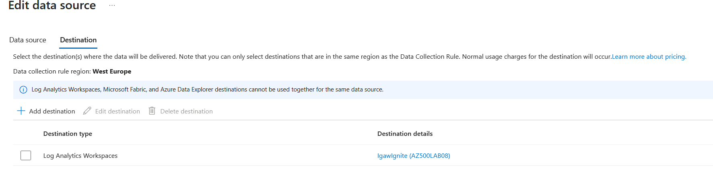
</figure>

<figure>
  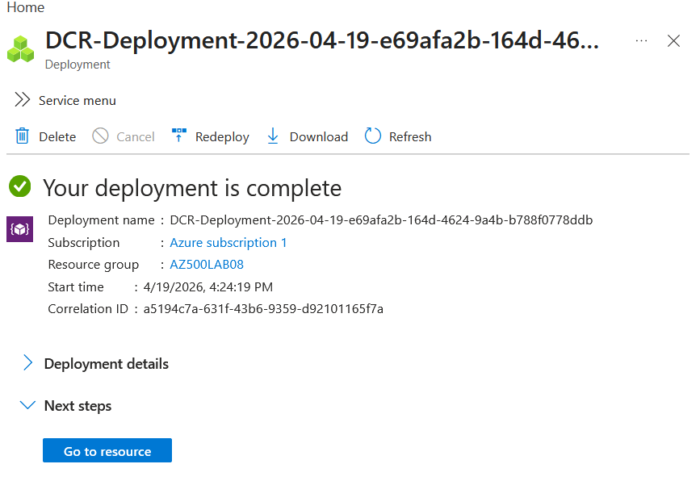
</figure>

# To go further

In order to capture performance data, AMA needs to be enabled on the VM:

<figure>
  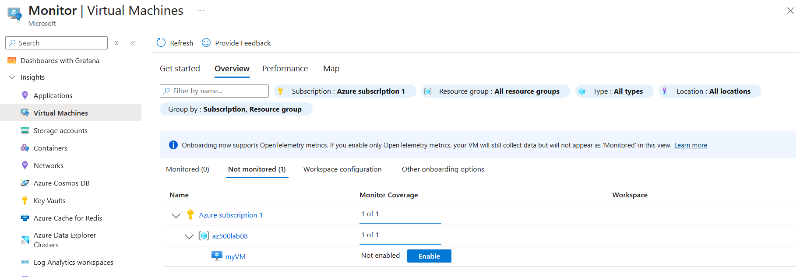
</figure>

<figure>
  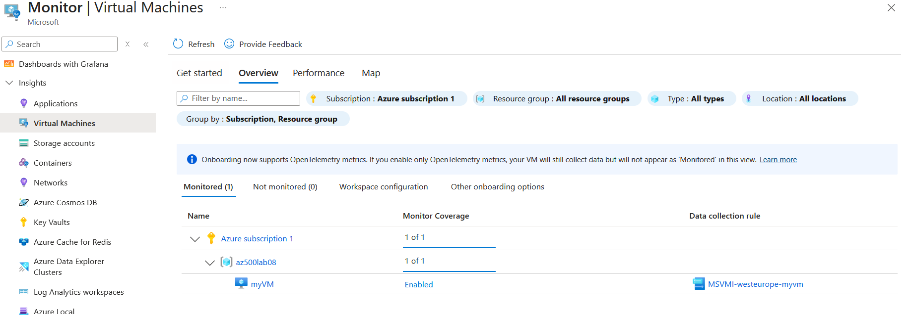
</figure>

Even though another DCR is created along with this action, we can still verify the DCR created in this lab works properly by querying the Log Analytics workspace created in the Exercise 2:

<figure>
  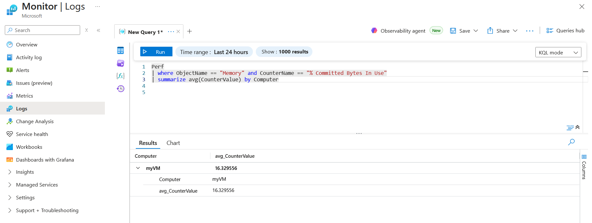
</figure>
