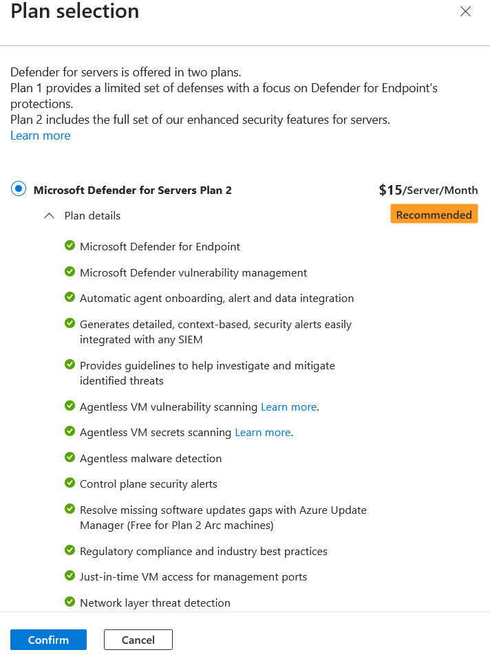
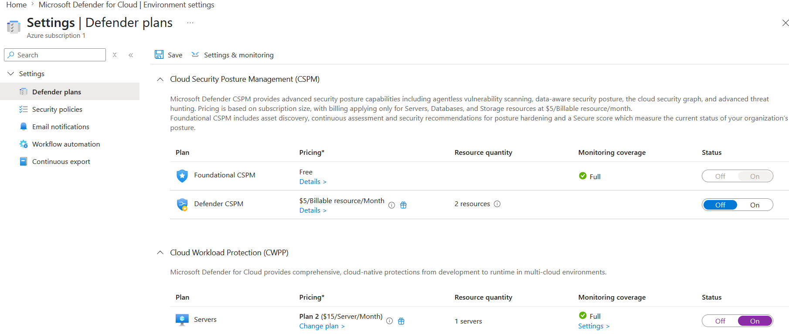

# Introduction

The goal of this lab is to enable Microsoft Defender for Servers in Microsoft Defender for Cloud to provide advanced threat protection and security monitoring for both Azure VMs and hybrid servers.

# Exercise: Enable Microsoft Defender for Cloud Enhanced Security Features for Servers

From the Azure portal, the Microsoft Defender for Servers Plan is enabled as follows:

<figure>
  
</figure>

<figure>
  
</figure>
