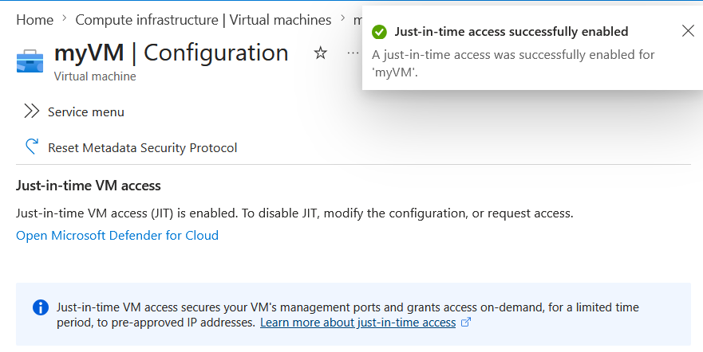
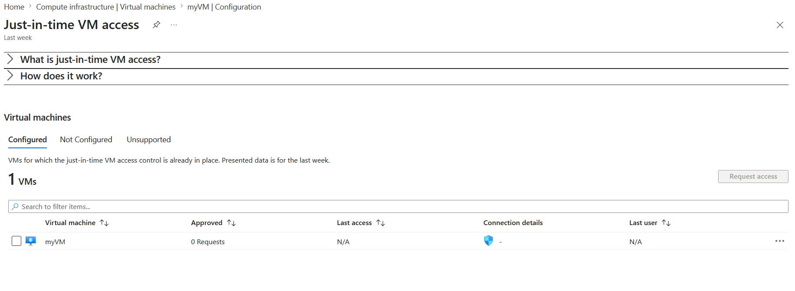
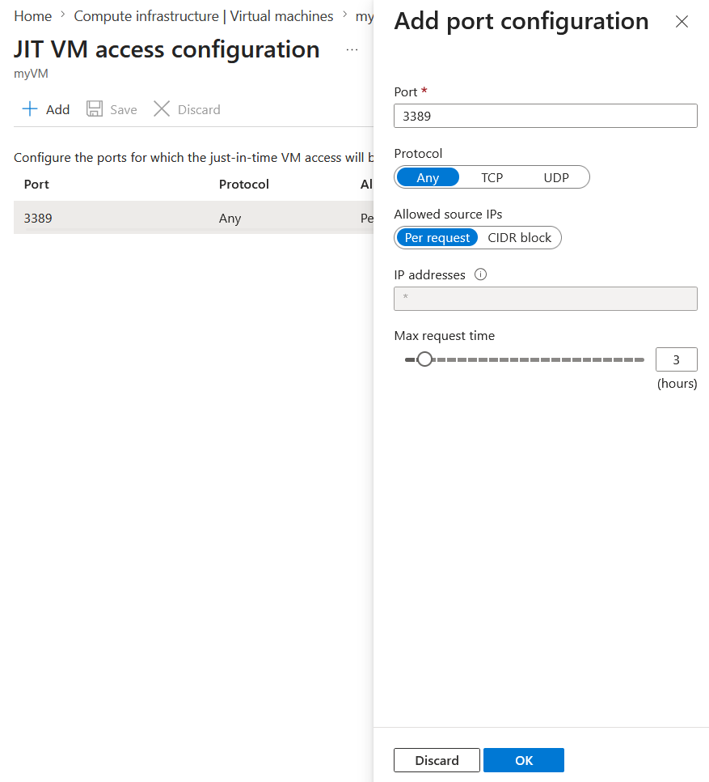
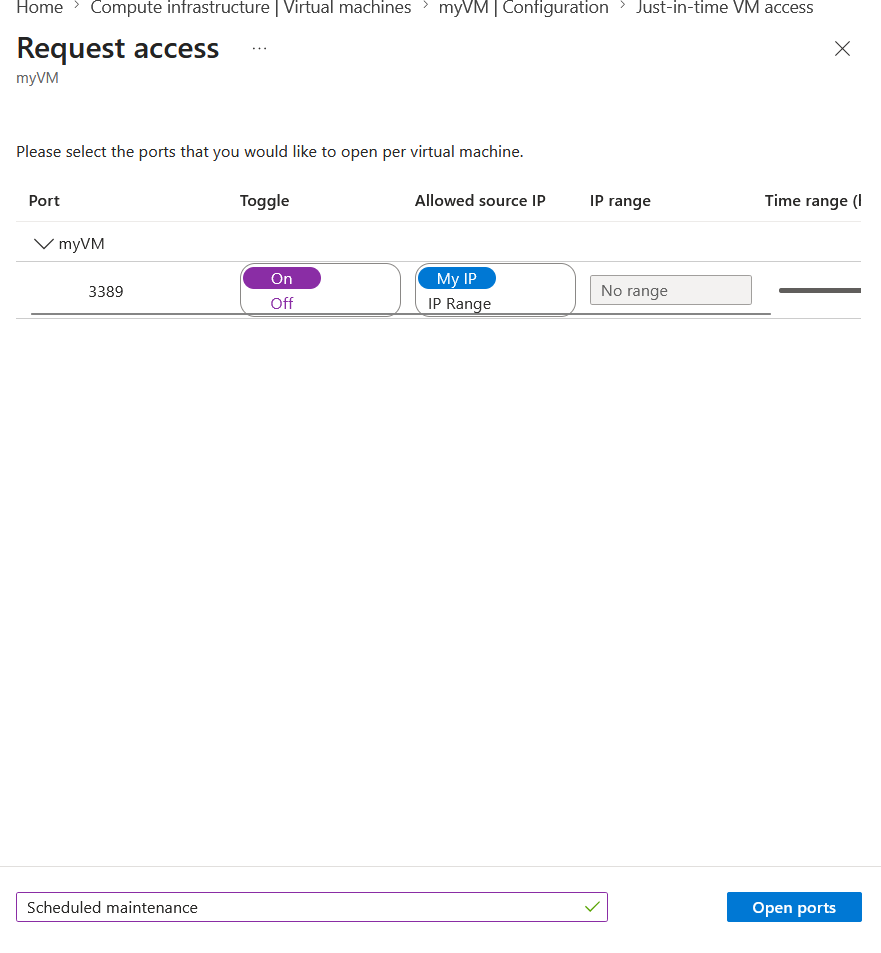
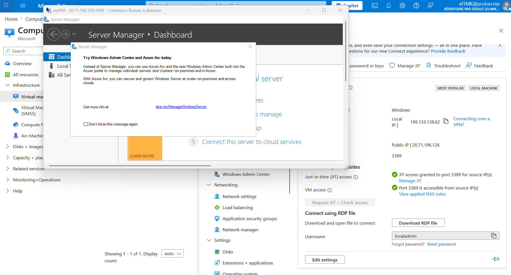
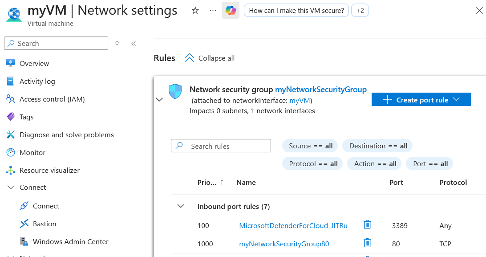

# Introduction

This lab focuses on configuring Just-in-Time (JIT) VM access in Microsoft Defender for Cloud.

The objective is to reduce the exposure of Azure VM management ports by allowing access only when it is required and for a limited period of time.

# Exercise 1: Enable JIT on your VMs from the Azure virtual machines

The goal of this first exercise is to enable and configure JIT on a VM. From the Azure portal, JIT is enabled and configured to allow RDP access for 3 hours as described below:

<figure>
  
</figure>

<figure>
  
</figure>

<figure>
  
</figure>

# Exercise 2: Request access to a JIT-enabled VM from the Azure virtual machine's connect page.

Now that JIT is enabled, it can be tested by submitting a JIT access request and trying to connect to the VM via RDP:

<figure>
  
</figure>

<figure>
  
</figure>

This access is allowed through the automatic creation of a rule in the NSG attached to the VM's NIC, as shown below:

<figure>
  
</figure>
