# Introduction

The goal of this lab is to create a proof of concept for threat detection and incident response using Microsoft Sentinel. The objective is to:

* Collect data from Azure Activity and Microsoft Defender for Cloud.
* Create built-in and custom alerts.
* Review how Playbooks can automate incident response.
* Investigate incidents generated by Sentinel.

The following architecture will be set up through the lab:

<figure>
  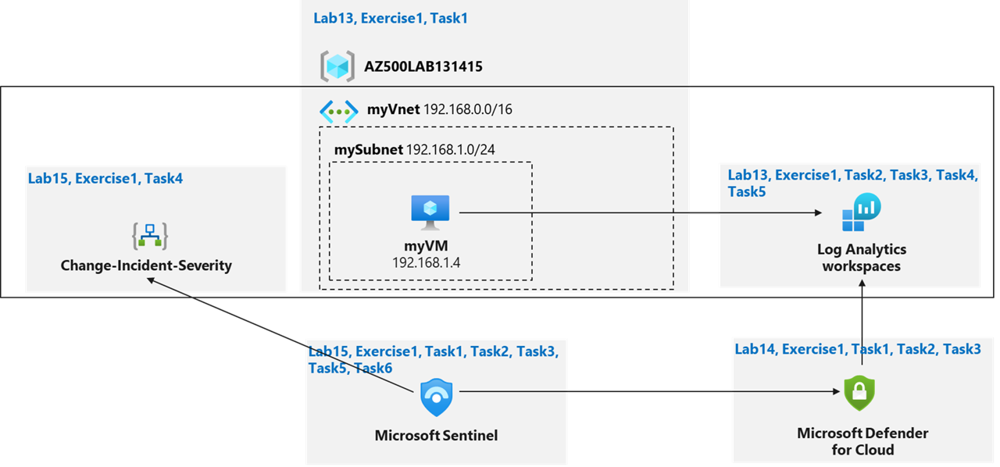
</figure>

# Exercise 1: Implement Microsoft Sentinel

## Task 1: On-board Microsoft Sentinel

 The first task is to onboard Microsoft Sentinel to the subscription from the Azure portal. The Log Analytics workspace created in LAB09 will be linked to Sentinel:

 <figure>
  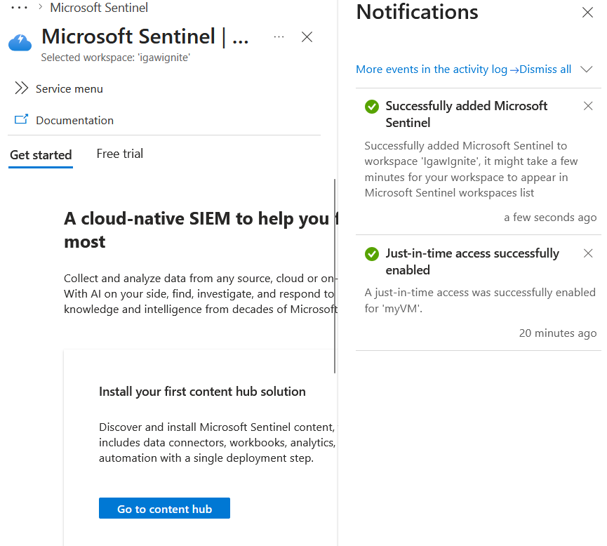
</figure>

## Task 2: Connect Azure Activity to Sentinel

The second step is to enable the Azure Activity connector to feed the workspace with Azure Activity logs for Sentinel to monitor it:

 <figure>
  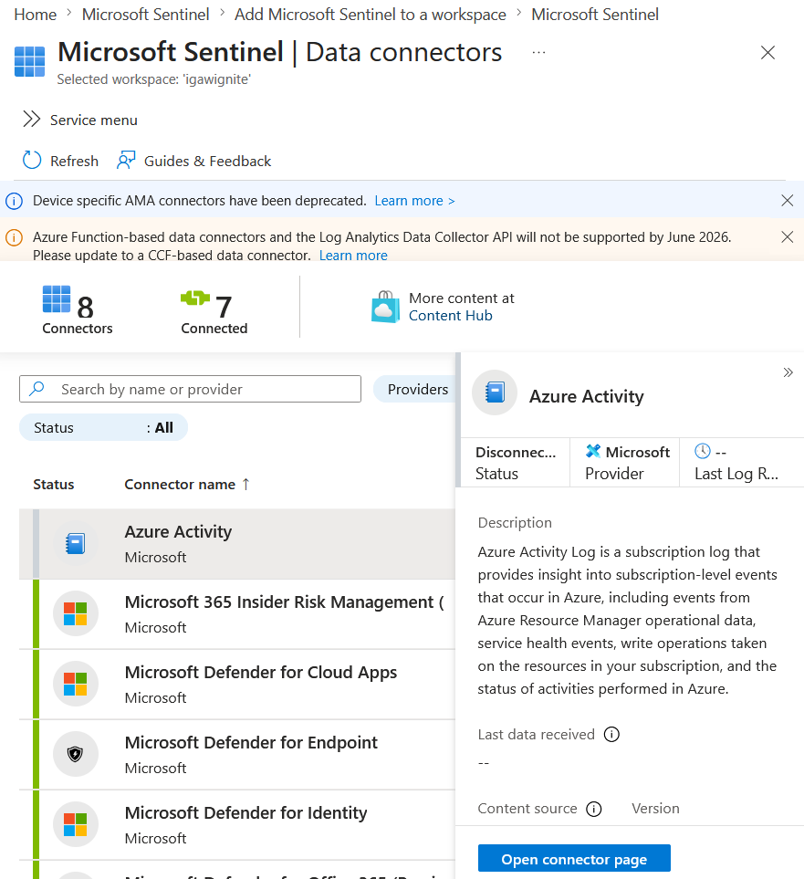
</figure>

 <figure>
  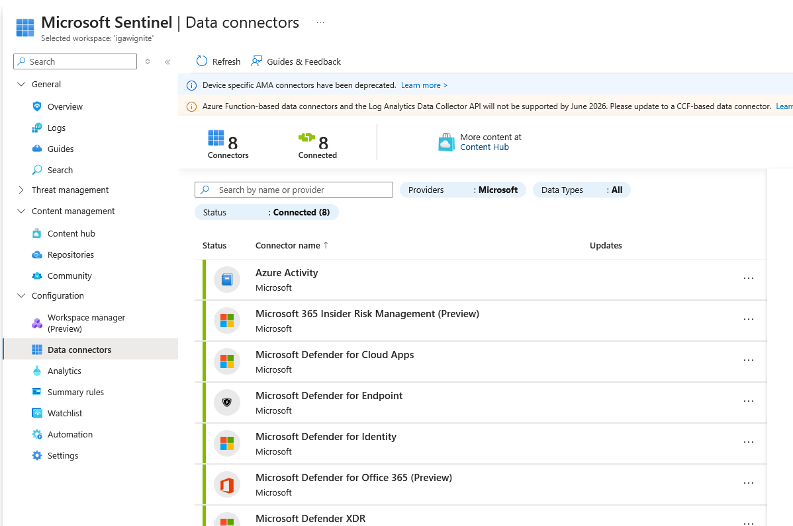
</figure>

 <figure>
  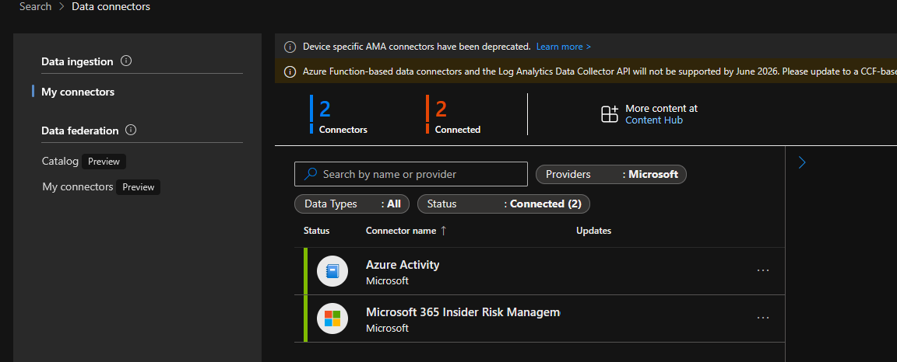
</figure>

## Task 3: Create a Rule Using Azure Activity Data

To get started with Sentinel capabilities, a built-in analytics rule will be configured and enabled on the Sentinel portal. This scheduled rule is triggered every 1 day and will detect anomalous resource creation or deployment activities from logs sent by Azure Activity:

 <figure>
  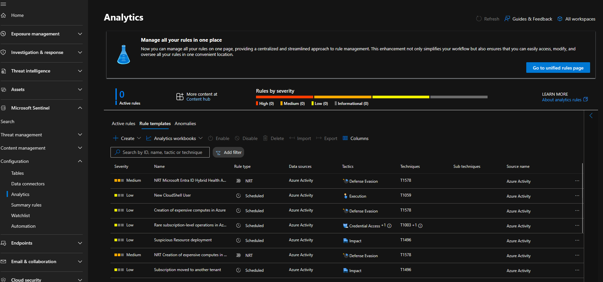
</figure>

 <figure>
  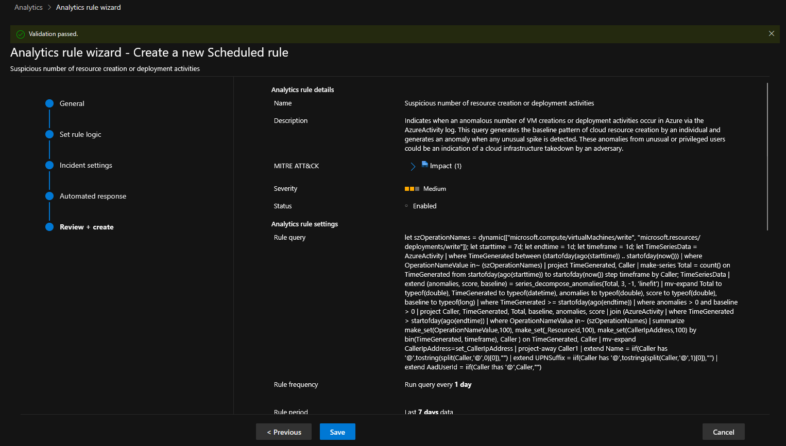
</figure>

 <figure>
  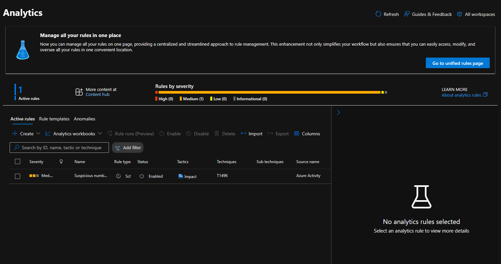
</figure>

## Task 4: Create a playbook

Now, a Logic App Playbook will be created. First, a Logic App Playbook is created to automatically increase the severity of incidents generated by the custom analytics rule:

*Note: the template provided for the lab uses a legacy format for Logic Apps. Thus, the Logic App has been customized using the new framework. Due to time constraints, the account criteria to raise the severity has not been implemented.*

 <figure>
  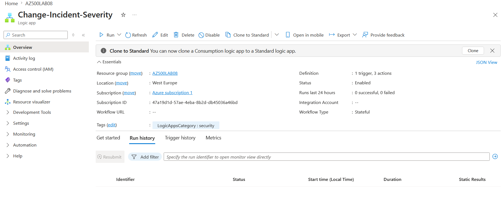
</figure>

 <figure>
  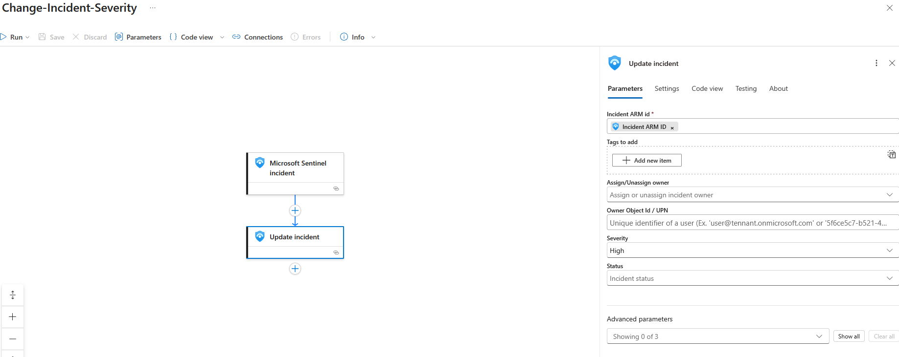
</figure>

## Task 5: Create a Custom Alert and Configure Automated Response

In task 5, a scheduled KQL query rule is created from the Sentinel portal to trigger an alert of severity Medium when a JIT network access policy is deleted (this data feed is provided by the Azure Activity connector in the Log Analytics workspace). When the analytic rule is triggered, Microsoft Sentinel generates an alert and automatically creates an incident from that alert. This query is performed every 5 minutes:

 <figure>
  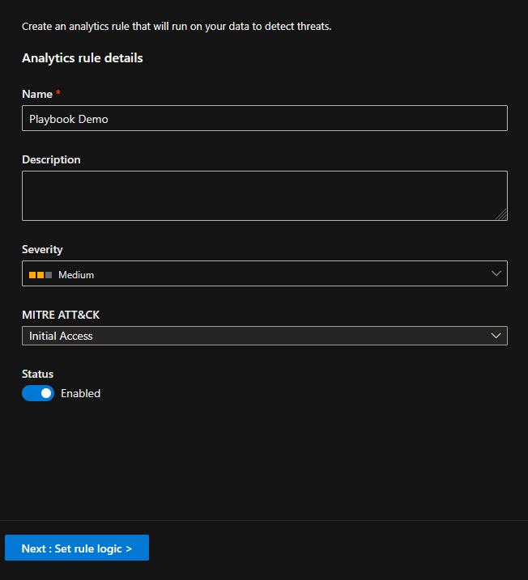
</figure>

 <figure>
  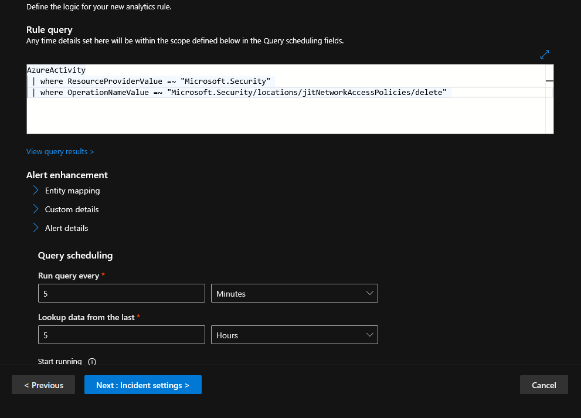
</figure>

 <figure>
  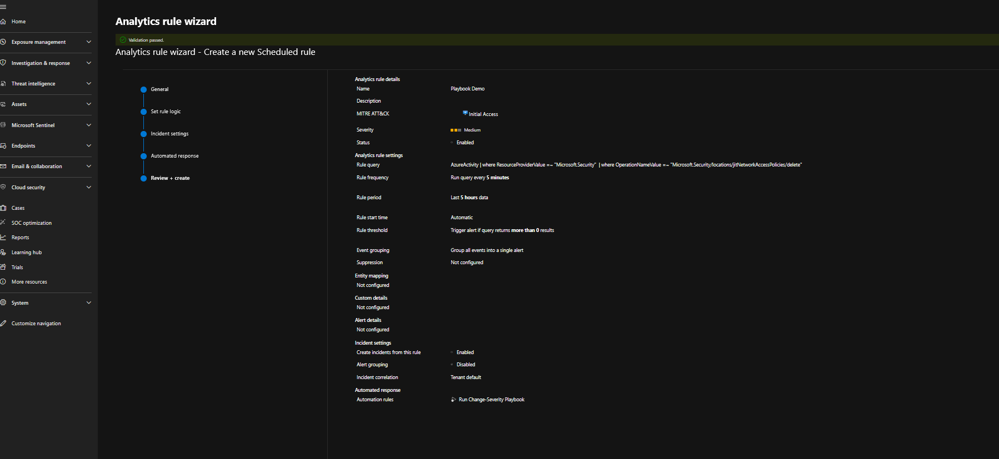
</figure>

Finally, two analytics rules are configured in Sentinel:

<figure>
  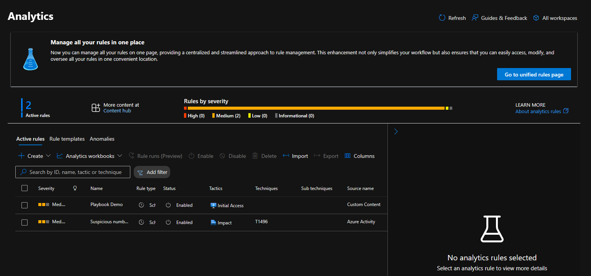
</figure>

## Task 6: Trigger an Incident and Review Actions

To test the analytic rule, a JIT network access policy is deleted. This action triggers the analytics rule, generates a Medium severity alert, and creates an incident. The Playbook then executes automatically and raises the incident severity to High, confirming that the automation workflow is functioning as expected:

<figure>
  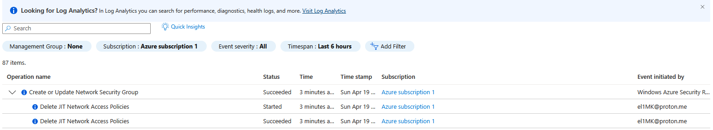
</figure>

<figure>
  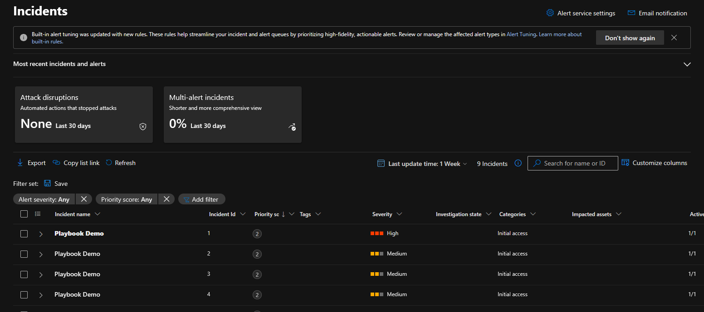
</figure>

# Conclusion

Through this lab, the end-to-end flow of anomaly detection, alert triggering and incident creation leveraging Microsoft Sentinel has been implemented:

```text
Azure Activity Logs
        │
        ▼
Log Analytics Workspace
        │
        ▼
Microsoft Sentinel
        │
        ▼
Analytics Rule
        │
        ▼
Alert (Medium)
        │
        ▼
Incident Creation
        │
        ▼
Automation Rule
        │
        ▼
Logic App Playbook
        │
        ▼
Incident Severity Updated (High)
