# Exercise 1: Deploy and test an Azure Firewall

## Task 1: Use a template to deploy the lab environment.
 To that extent, the official template provided ([here](https://github.com/MicrosoftLearning/AZ500-AzureSecurityTechnologies/blob/master/Allfiles/Labs/08/template.json)) will be used.
 The template sets up the architecture described below which associated to the resource group "AZ500LAB03":

<figure>
  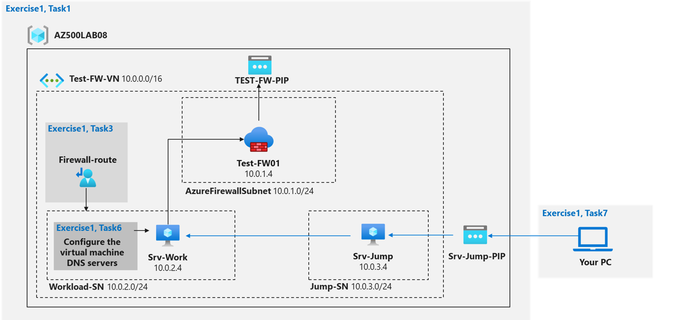
</figure>

The following resources have been deployed using the scripts, others will be deployed later in the lab:

<figure>
  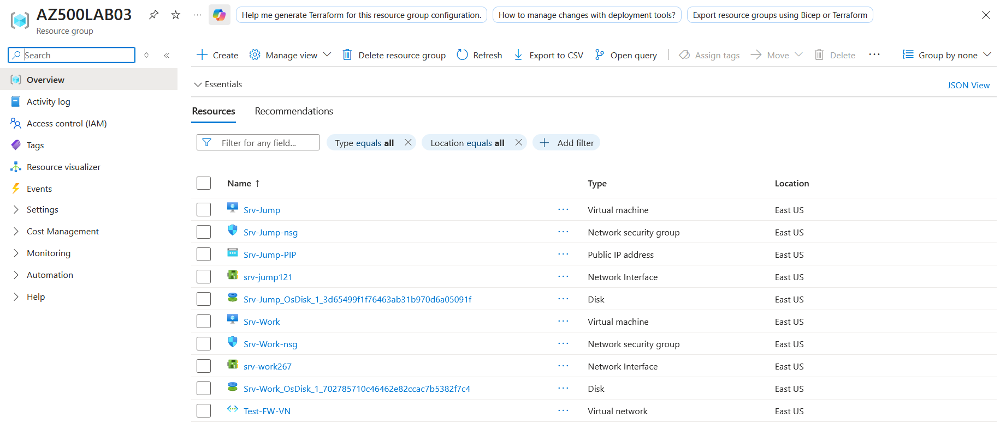
</figure>

## Task 2: Deploy the Azure firewall

The Azure firewall has been created and deployed as follows:

<figure>
  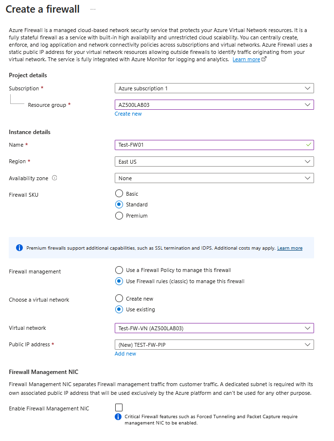
</figure>

<figure>
  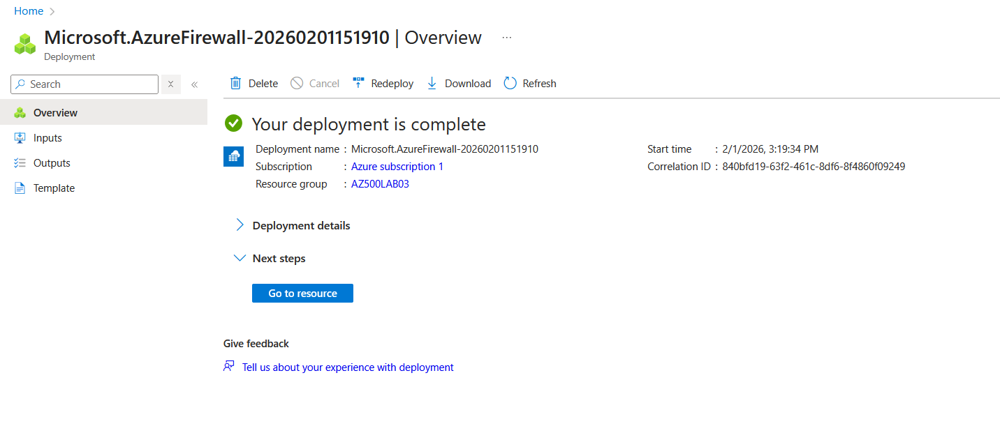
</figure>

## Task 3: Create a default route

The goal is to create a default route for the Workload-SN subnet. This route will configure outbound traffic through the firewall.

The first step is to create and deploy the route table:

<figure>
  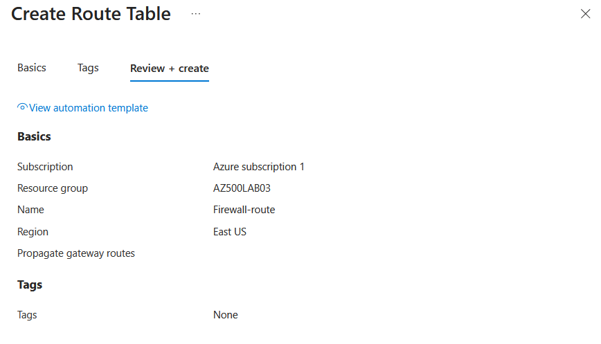
</figure>

<figure>
  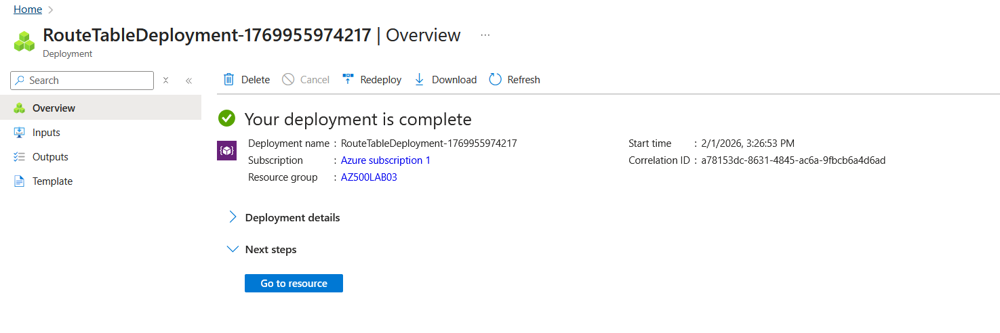
</figure>

Then the route table is associated to the Workload-SN subnet:

<figure>
  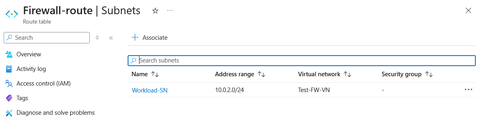
</figure>

Finally, a rule to force all outbound traffic from the subnet to go through the firewall is defined:

<figure>
  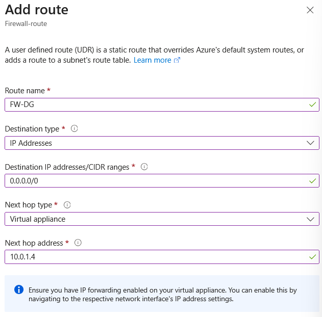
</figure>

<figure>
  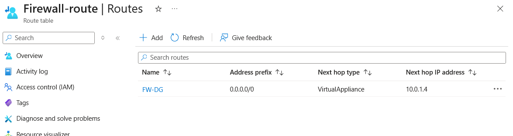
</figure>

## Task 4: Configure an application rule

The goal is to create an application rule in the firewall that allows outbound access to www.bing.com

The application rule is created, specifying the source IP range and protocols used to reach a specific domain name, then applied:

<figure>
  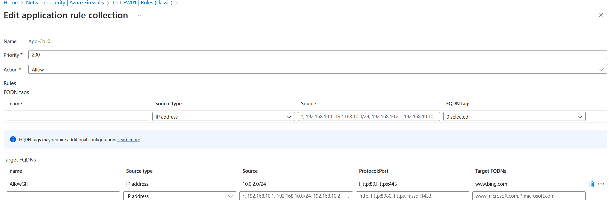
</figure>

<figure>
  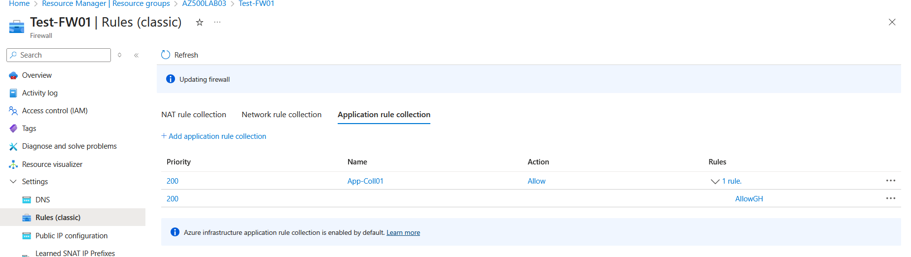
</figure>

## Task 5: Configure a network rule

The goal is to create a network rule in the firewall that allows outbound access to two IP addresses on port 53 (DNS).

The network rule is created, specifying the source IP range, protocol, destination IP addresses and port, then applied:

<figure>
  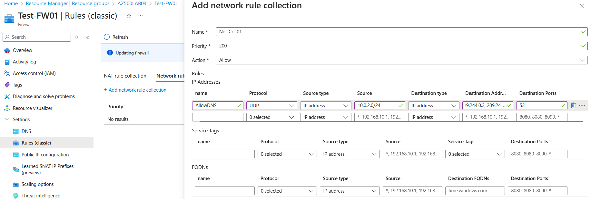
</figure>

<figure>
  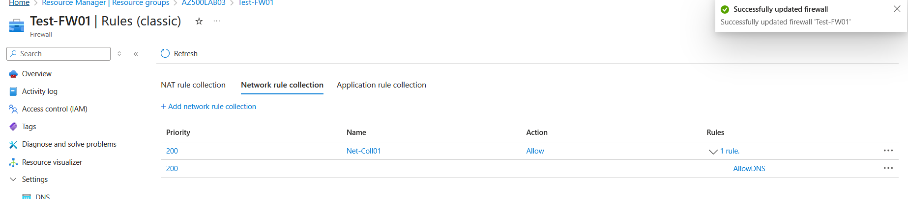
</figure>

## Task 6: Configure the virtual machine DNS servers

The goal is to configure the primary and secondary DNS addresses for the virtual machine. This is not a firewall requirement, but it will allow to test the application rule:

<figure>
  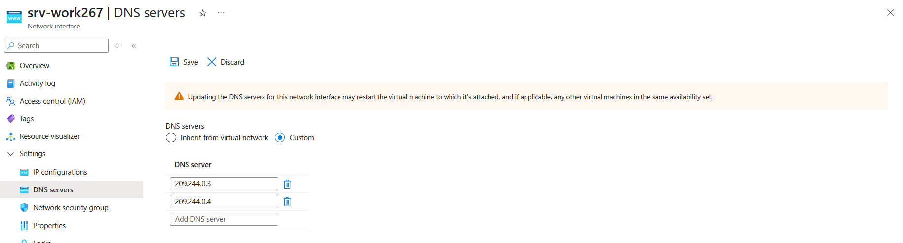
</figure>

## Task 7: Test the firewall

The goal is to test the firewall to confirm that it works as expected.

The first step is to connect to the jump server:

<figure>
  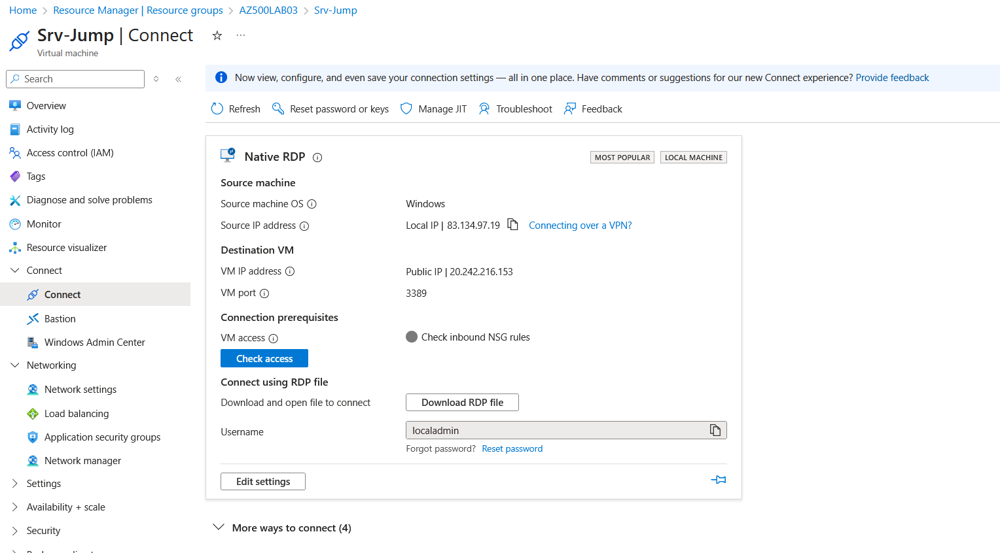
</figure>

Then connect to the working server using the command ```mstsc /v:Srv-Work in a shell```:

<figure>
  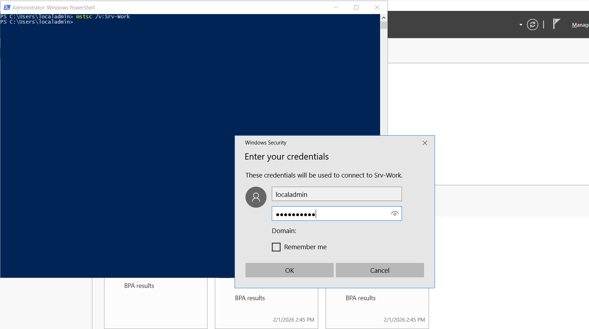
</figure>

Internet Explorer Enhanced Security Configuration must be disabled to perform our tests:

<figure>
  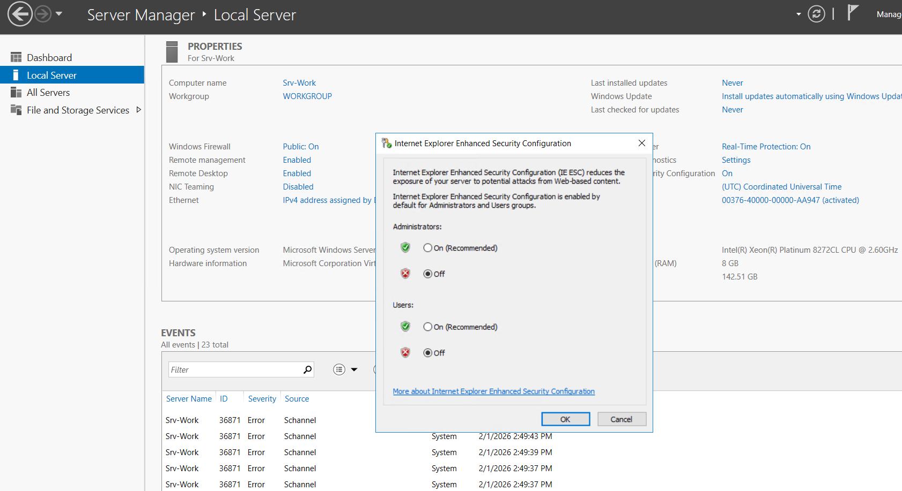
</figure>

The firewall rules are tested through the browser and the desired behavior is observed as www.bing.com can be reached, whereas www.microsoft.com cannot:

<figure>
  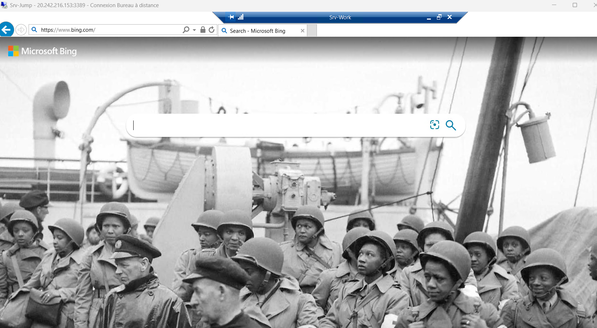
</figure>

<figure>
  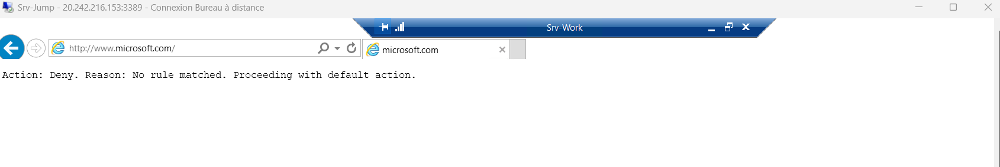
</figure>

 ## Clean-up resources
 Resources can be easily cleaned running the following command in Azure:
 ```Remove-AzResourceGroup -Name "AZ500LAB08" -Force -AsJob```

