# Exercise 1: Configuring and Securing ACR and AKS

The following architecture will be deployed and used throughout the exercise:

<figure>
  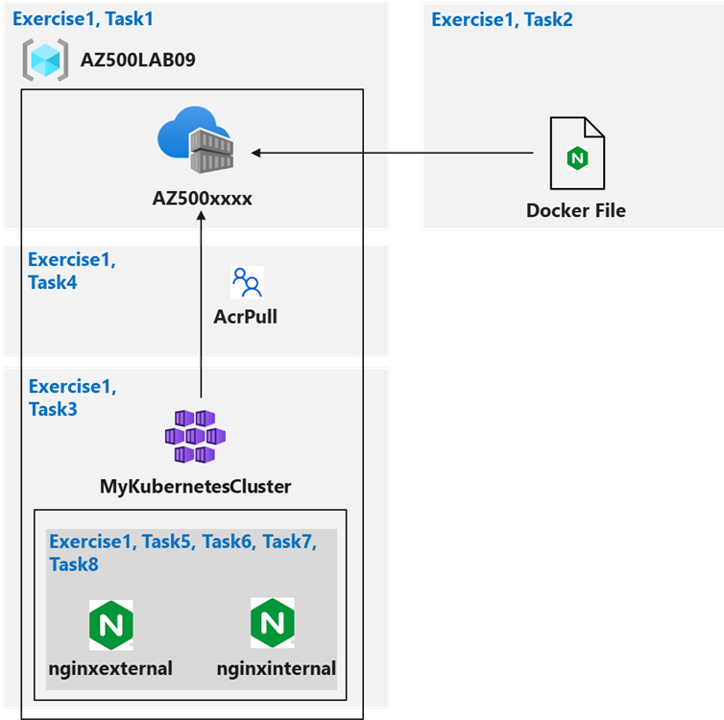
</figure>

## Task 1: Create an Azure Container Registry

The first step is to create a resource group to be used for the lab and an Azure Container Registry:
```sh 
az group create --name AZ500LAB04 --location eastus
```

<figure>
  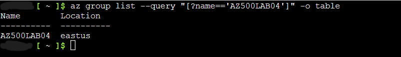
</figure>

The Container Registry is registered in the lab environment:
```sh
az provider register --namespace Microsoft.Kubernetes
az provider register --namespace Microsoft.KubernetesConfiguration
az provider register --namespace Microsoft.OperationsManagement
az provider register --namespace Microsoft.OperationalInsights
az provider register --namespace Microsoft.ContainerService
az provider register --namespace Microsoft.ContainerRegistry
```
A new Azure Container Registry (ACR) instance is created:
```sh
az acr create --resource-group AZ500LAB04 --name az500$RANDOM$RANDOM --sku Basic
```

<figure>
  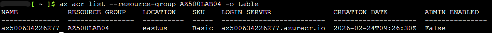
</figure>

## Task 2: Create a Dockerfile, build a container and push it to Azure Container Registry

The goal is to create a Dockerfile, build an image from the Dockerfile, and deploy the image to the ACR.

First, a Dockerfile is created to create the Nginx image:

```sh
    echo FROM nginx > Dockerfile
```
Then, the image is built from the Dockerfile and pushed to the ACR:

```sh
    ACRNAME=$(az acr list --resource-group AZ500LAB04 --query '[].{Name:name}' --output tsv)

    az acr build --resource-group AZ500LAB04 --image sample/nginx:v1 --registry $ACRNAME --file Dockerfile .
```
The new container image has been created in the ACR:

<figure>
  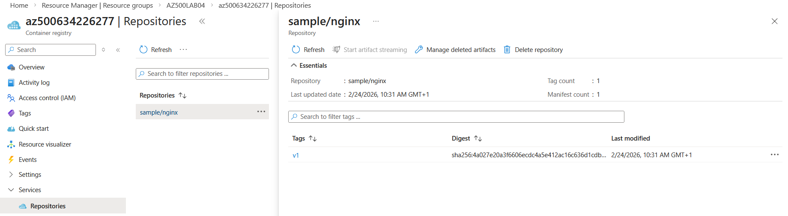
</figure>

<figure>
  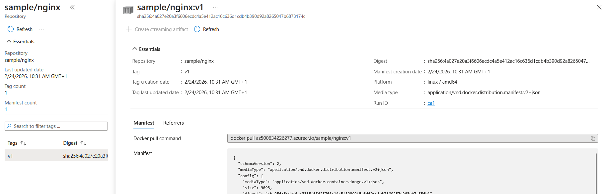
</figure>

## Task 3: Create an Azure Kubernetes Service cluster

The goal is to create an Azure Kubernetes service and review the deployed resources.

After configuration, the AKS cluster is deployed:

<figure>
  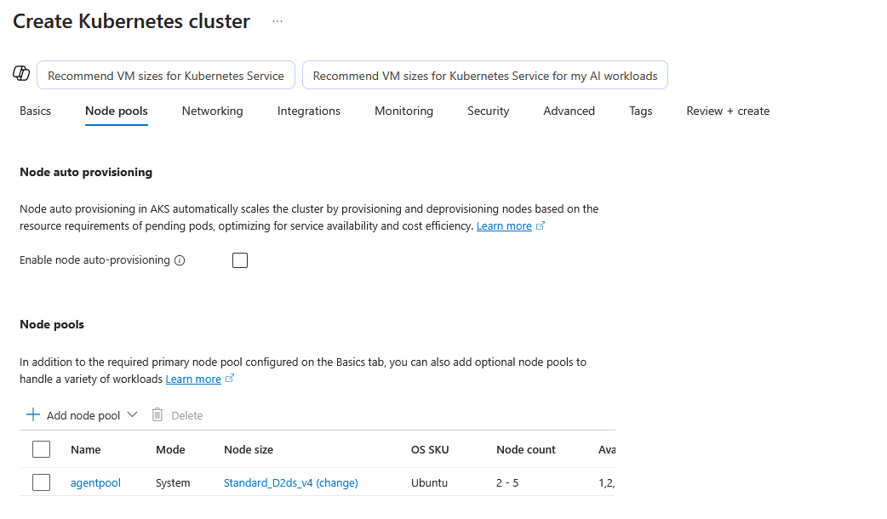
</figure>

>**Note**: The VM used for the node differs from the one used in the official lab for availability reasons. The remaining steps of the lab are not impacted.

<figure>
  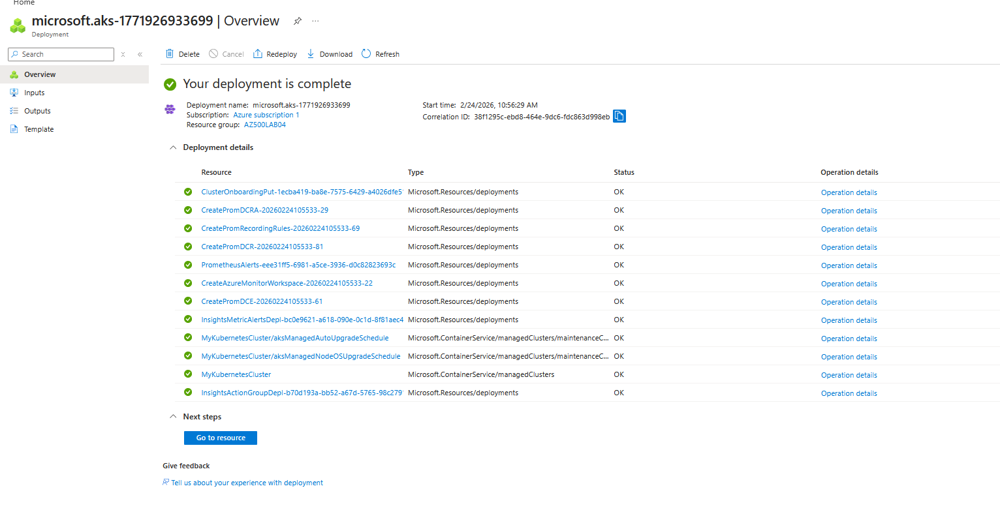
</figure>

The resource group holding components of the AKS node has been created and the AKS now appears in the lab resource group:

<figure>
  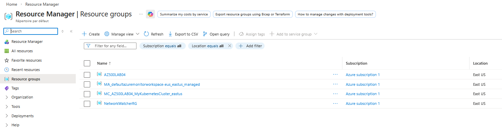
</figure>

  <figure>
  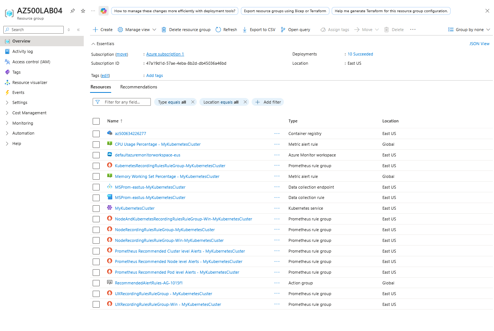
</figure>

The following command is run to connect to the cluster:

 ```sh
    az aks get-credentials --resource-group AZ500LAB04 --name MyKubernetesCluster
 ```

<figure>
  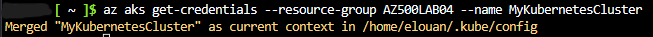
</figure>

The list of nodes is given by:
 ```sh
    kubectl get nodes
 ```
<figure>
  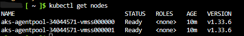
</figure>


## Task 4: Grant the AKS cluster permissions to access the ACR and manage its virtual network

In this task, AKS cluster will be granted permission to access the ACR and manage its virtual network.

The AKS cluster and the ACR are linked using:

```sh
    ACRNAME=$(az acr list --resource-group AZ500LAB04 --query '[].{Name:name}' --output tsv)

    az aks update -n MyKubernetesCluster -g AZ500LAB04 --attach-acr $ACRNAME
```

The *Contributor* role is given to the AKS cluster to its virtual network to be able to perform the actions in the next tasks using:

 ```sh
    RG_AKS=AZ500LAB04

    RG_VNET=MC_AZ500LAB04_MyKubernetesCluster_eastus	

    AKS_VNET_NAME=aks-vnet-30198516
    
    AKS_CLUSTER_NAME=MyKubernetesCluster
    
    AKS_VNET_ID=$(az network vnet show --name $AKS_VNET_NAME --resource-group $RG_VNET --query id -o tsv)
    
    AKS_MANAGED_ID=$(az aks show --name $AKS_CLUSTER_NAME --resource-group $RG_AKS --query identity.principalId -o tsv)
    
    az role assignment create --assignee $AKS_MANAGED_ID --role "Contributor" --scope $AKS_VNET_ID
 ```


## Task 5: Deploy an external service to AKS

The goal is to use a Manifest file (yaml) to apply changes to the cluster. The files in the folder [/scripts](https://github.com/EL1MK/AZ500-LAB04-ConfiguringAndSecuringACR-AKS/tree/main/scripts) are used.

After configuring the file nginxexternal.yaml with the name of the ACR, we apply the changes and verifying that the corresponding services have been created using:

 ```sh
    kubectl apply -f nginxexternal.yaml
 ```

<figure>
  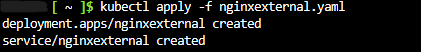
</figure>

## Task 6: Verify that you can access an external AKS-hosted service

In this task, the goal is to verify that the container can be accessed externally using the public IP address.

The IP address and port of the nginxexternal service is retrieved using:

```sh
    kubectl get service nginxexternal
```

<figure>
  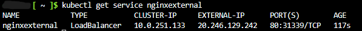
</figure>

By attempting to browse with a navigator to the IP address, the expected result is displayed:

<figure>
  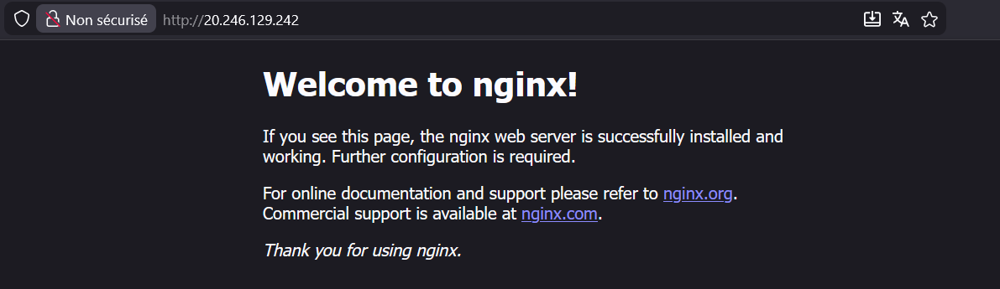
</figure>

## Task 7: Deploy an internal service to AKS

In this task, the goal is to deploy an internal facing service on the AKS cluster.

Similarly to the external service, the configuration file is edited to add the correct ACR name:

<figure>
  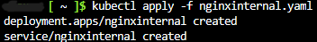
</figure>

The IP address and port of the nginxinternal service is retrieved using:
   ```sh
    kubectl get service nginxinternal
  ```

<figure>
  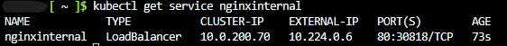
</figure>

The IP address displayed here is a private IP for which a connection will be made through a pod of the cluster as it needs to be accessed internally.

## Task 8: Verify that you can access an internal AKS-hosted service

The goal of this last step is to test the access to the internal service through a pod inside the AKS cluster.

The list of pods is given using:

```sh
    kubectl get pods
```

<figure>
  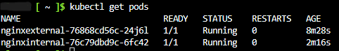
</figure>

A connection is made to the pod using:

 ```sh
    kubectl exec -it nginxinternal-76c79dbd9c-6fc42 -- /bin/bash
 ```

Via the pod, the following command is executed to verify that the nginx web site is available using the private IP address:
 ```sh
    curl http://10.224.0.6
 ```

As expected, the following is displayed in the console:

<figure>
  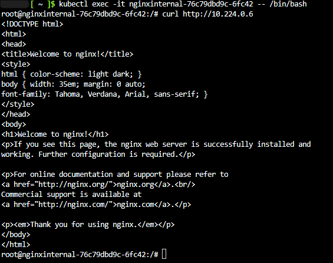
</figure>

## Clean-up resources

All resources are deleted using:

 ```powershell
    Remove-AzResourceGroup -Name "AZ500LAB04" -Force -AsJob
 ```


